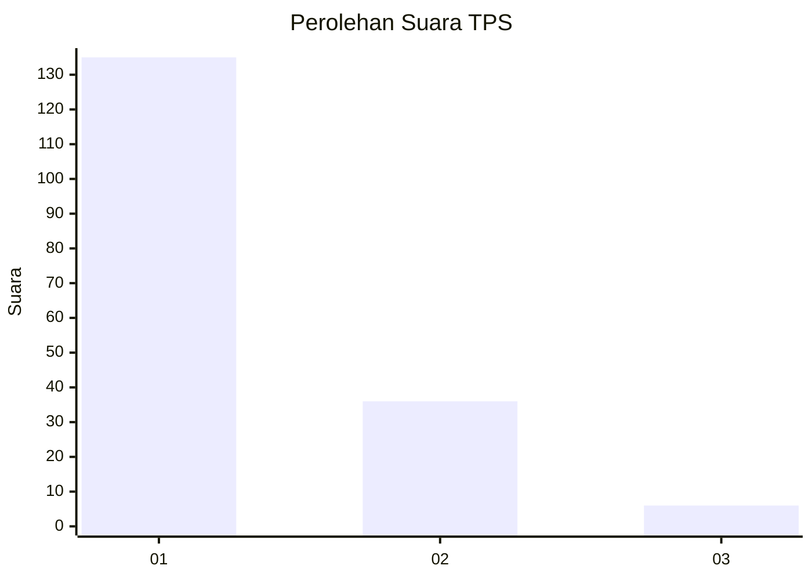
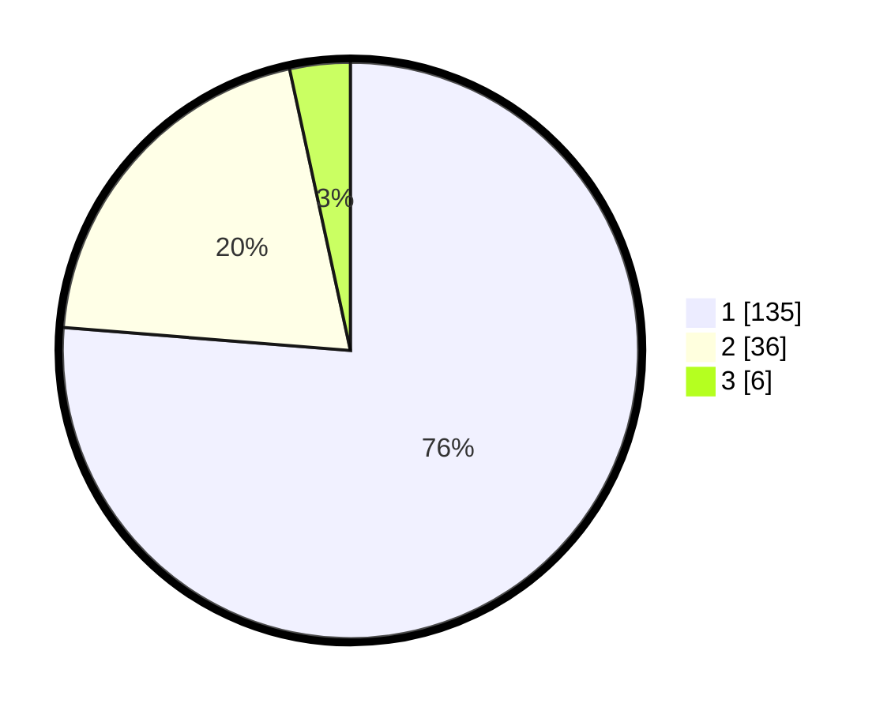

# Hasil

## Grafik

## Tabel

| No. | Nama Paslon    | Suara | Suara (raw) | Persentase |
|:--- |:-------------- | -----:| -----------:| ----------:|
| 1   | ANIES MUHAIMIN | 135   | [135][p-1]  | 76,27      |
| 2   | PRABOWO GIBRAN | 36    | [36][p-2]   | 20,34      |
| 3   | GANJAR MAHFUD  | 6     | [6][p-3]    | 3,39       |

[p-1]: https://github.com/gigit-pemilu/pemilu-2024-63-kalimantan-selatan/blob/main/pilpres/hitung-suara/sub/63-kalimantan-selatan/sub/08-hulu-sungai-utara/sub/08-haur-gading/sub/2012-tambak-sari-panji/sub/002-tps/sub/paslon-1.txt
[p-2]: https://github.com/gigit-pemilu/pemilu-2024-63-kalimantan-selatan/blob/main/pilpres/hitung-suara/sub/63-kalimantan-selatan/sub/08-hulu-sungai-utara/sub/08-haur-gading/sub/2012-tambak-sari-panji/sub/002-tps/sub/paslon-2.txt
[p-3]: https://github.com/gigit-pemilu/pemilu-2024-63-kalimantan-selatan/blob/main/pilpres/hitung-suara/sub/63-kalimantan-selatan/sub/08-hulu-sungai-utara/sub/08-haur-gading/sub/2012-tambak-sari-panji/sub/002-tps/sub/paslon-3.txt

## Foto C Plano

https://sirekap-obj-formc.kpu.go.id/5e5c/pemilu/ppwp/63/08/08/20/12/6308082012002-20240214-210911--c75032aa-8c50-4cb1-a54a-a63701e71cde.jpg

https://sirekap-obj-formc.kpu.go.id/5e5c/pemilu/ppwp/63/08/08/20/12/6308082012002-20240214-141544--c5699f79-ac5f-48bc-8a74-0185a10eb3eb.jpg

https://sirekap-obj-formc.kpu.go.id/5e5c/pemilu/ppwp/63/08/08/20/12/6308082012002-20240214-211150--88df6bcb-e9dd-42f6-b52e-66eab5a14fb2.jpg

## Metadata

| Key        | Value               |
| ---------- | ------------------- |
| Time Stamp | 2024-02-19 06:16:00 |

