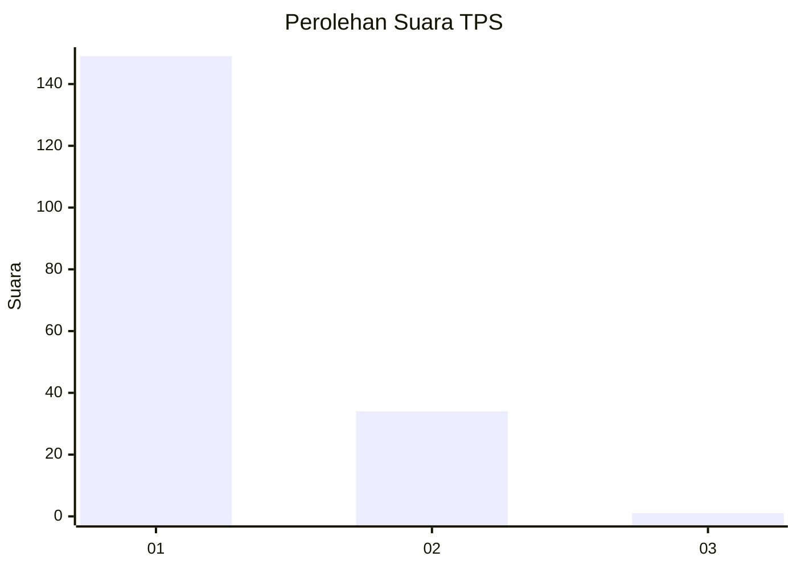
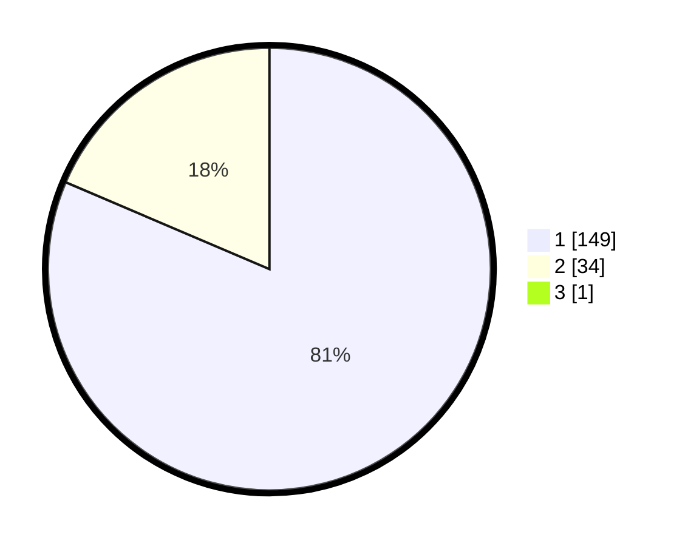

# Hasil

## Grafik

## Tabel

| No. | Nama Paslon    | Suara | Suara (raw) | Persentase |
|:--- |:-------------- | -----:| -----------:| ----------:|
| 1   | ANIES MUHAIMIN | 149   | [149][p-1]  | 80,98      |
| 2   | PRABOWO GIBRAN | 34    | [34][p-2]   | 18,48      |
| 3   | GANJAR MAHFUD  | 1     | [1][p-3]    | 0,54       |

[p-1]: https://github.com/gigit-pemilu/pemilu-2024-63-kalimantan-selatan/blob/main/pilpres/hitung-suara/sub/63-kalimantan-selatan/sub/08-hulu-sungai-utara/sub/08-haur-gading/sub/2013-pulantani/sub/001-tps/sub/paslon-1.txt
[p-2]: https://github.com/gigit-pemilu/pemilu-2024-63-kalimantan-selatan/blob/main/pilpres/hitung-suara/sub/63-kalimantan-selatan/sub/08-hulu-sungai-utara/sub/08-haur-gading/sub/2013-pulantani/sub/001-tps/sub/paslon-2.txt
[p-3]: https://github.com/gigit-pemilu/pemilu-2024-63-kalimantan-selatan/blob/main/pilpres/hitung-suara/sub/63-kalimantan-selatan/sub/08-hulu-sungai-utara/sub/08-haur-gading/sub/2013-pulantani/sub/001-tps/sub/paslon-3.txt

## Foto C Plano

https://sirekap-obj-formc.kpu.go.id/1ac5/pemilu/ppwp/63/08/08/20/13/6308082013001-20240214-214905--08113a72-c9a5-4176-a529-03ffce8f966e.jpg

https://sirekap-obj-formc.kpu.go.id/1ac5/pemilu/ppwp/63/08/08/20/13/6308082013001-20240214-225952--e984e653-9ea9-44d4-9bdf-1beb9c7a0c2c.jpg

https://sirekap-obj-formc.kpu.go.id/1ac5/pemilu/ppwp/63/08/08/20/13/6308082013001-20240214-215121--3522587e-4caf-4833-9355-c11ff154ad04.jpg

## Metadata

| Key        | Value               |
| ---------- | ------------------- |
| Time Stamp | 2024-02-19 06:16:00 |

