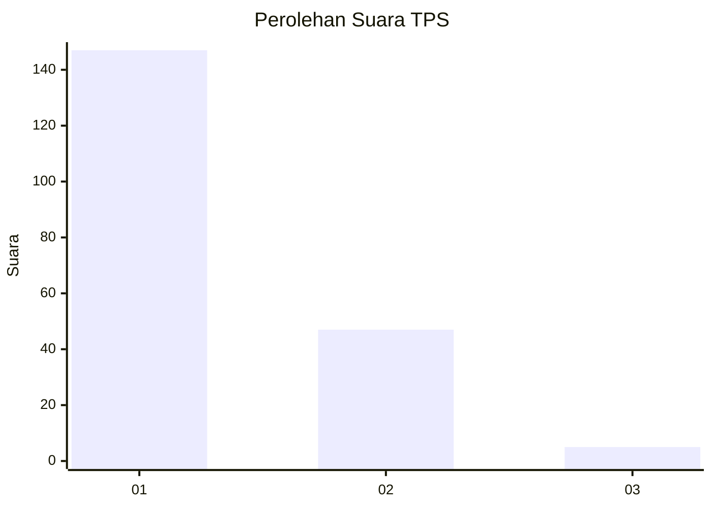
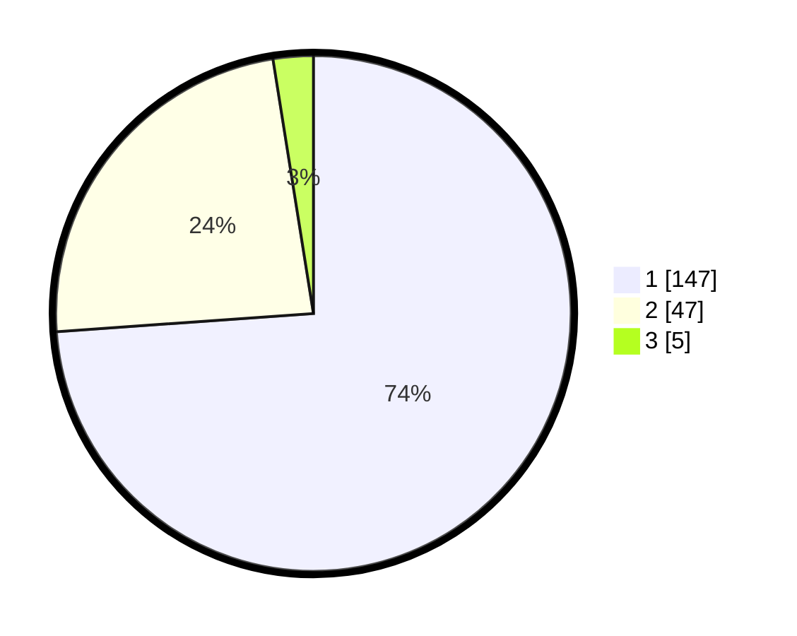

# Hasil

## Grafik

## Tabel

| No. | Nama Paslon    | Suara | Suara (raw) | Persentase |
|:--- |:-------------- | -----:| -----------:| ----------:|
| 1   | ANIES MUHAIMIN | 147   | [147][p-1]  | 73,87      |
| 2   | PRABOWO GIBRAN | 47    | [47][p-2]   | 23,62      |
| 3   | GANJAR MAHFUD  | 5     | [5][p-3]    | 2,51       |

[p-1]: https://github.com/gigit-pemilu/pemilu-2024/blob/main/pilpres/hitung-suara/sub/63-kalimantan-selatan/sub/09-tabalong/sub/02-kelua/sub/2003-telaga-itar/sub/003-tps/sub/paslon-1.txt
[p-2]: https://github.com/gigit-pemilu/pemilu-2024/blob/main/pilpres/hitung-suara/sub/63-kalimantan-selatan/sub/09-tabalong/sub/02-kelua/sub/2003-telaga-itar/sub/003-tps/sub/paslon-2.txt
[p-3]: https://github.com/gigit-pemilu/pemilu-2024/blob/main/pilpres/hitung-suara/sub/63-kalimantan-selatan/sub/09-tabalong/sub/02-kelua/sub/2003-telaga-itar/sub/003-tps/sub/paslon-3.txt

## Foto C Plano

https://sirekap-obj-formc.kpu.go.id/bd73/pemilu/ppwp/63/09/02/20/03/6309022003003-20240214-232001--d51f611e-0086-4e26-a0a6-ed76b6538084.jpg

https://sirekap-obj-formc.kpu.go.id/bd73/pemilu/ppwp/63/09/02/20/03/6309022003003-20240214-141606--d5277939-e238-43fd-8b57-3f0e92f03a8e.jpg

https://sirekap-obj-formc.kpu.go.id/bd73/pemilu/ppwp/63/09/02/20/03/6309022003003-20240214-232644--9807974f-c108-4372-8de7-c759140c0092.jpg

## Metadata

| Key        | Value               |
| ---------- | ------------------- |
| Time Stamp | 2024-02-15 12:00:28 |

