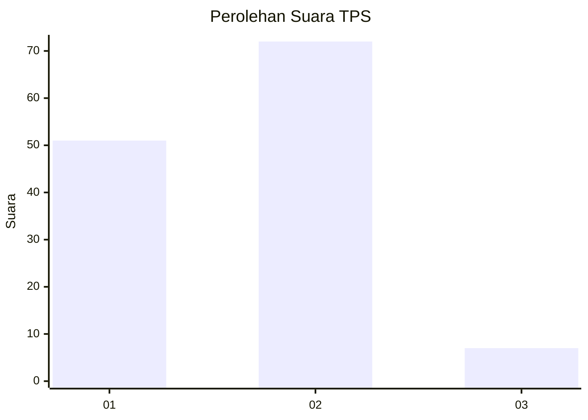
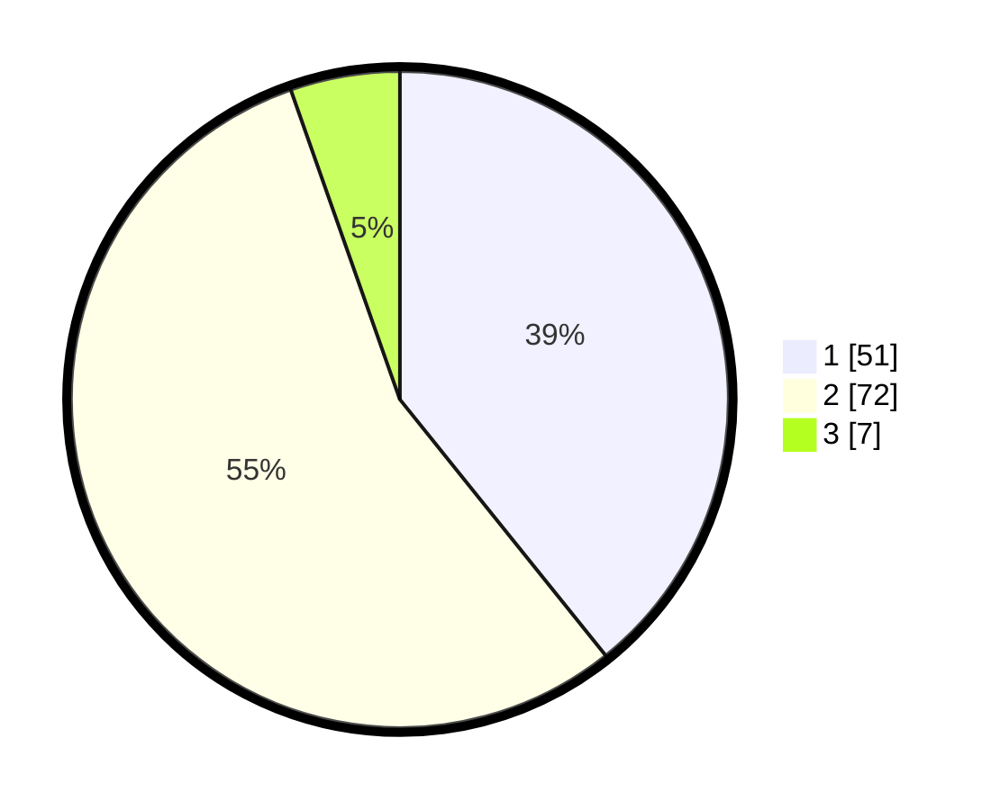

# Hasil

## Grafik

## Tabel

| No. | Nama Paslon    | Suara | Suara (raw) | Persentase |
|:--- |:-------------- | -----:| -----------:| ----------:|
| 1   | ANIES MUHAIMIN | 51    | [51][p-1]   | 39,23      |
| 2   | PRABOWO GIBRAN | 72    | [72][p-2]   | 55,38      |
| 3   | GANJAR MAHFUD  | 7     | [7][p-3]    | 5,38       |

[p-1]: https://github.com/gigit-pemilu/pemilu-2024-63-kalimantan-selatan/blob/main/pilpres/hitung-suara/sub/63-kalimantan-selatan/sub/09-tabalong/sub/06-murung-pudak/sub/1001-belimbing-raya/sub/007-tps/sub/paslon-1.txt
[p-2]: https://github.com/gigit-pemilu/pemilu-2024-63-kalimantan-selatan/blob/main/pilpres/hitung-suara/sub/63-kalimantan-selatan/sub/09-tabalong/sub/06-murung-pudak/sub/1001-belimbing-raya/sub/007-tps/sub/paslon-2.txt
[p-3]: https://github.com/gigit-pemilu/pemilu-2024-63-kalimantan-selatan/blob/main/pilpres/hitung-suara/sub/63-kalimantan-selatan/sub/09-tabalong/sub/06-murung-pudak/sub/1001-belimbing-raya/sub/007-tps/sub/paslon-3.txt

## Foto C Plano

https://sirekap-obj-formc.kpu.go.id/51f6/pemilu/ppwp/63/09/06/10/01/6309061001007-20240215-010507--9893b2bc-32ae-4e4d-ad11-a01d75eb915c.jpg

https://sirekap-obj-formc.kpu.go.id/51f6/pemilu/ppwp/63/09/06/10/01/6309061001007-20240215-010553--3308bdcc-7cff-41a4-8bfd-62746eb6bff2.jpg

https://sirekap-obj-formc.kpu.go.id/51f6/pemilu/ppwp/63/09/06/10/01/6309061001007-20240215-010654--7946e362-5f35-4f14-a931-9c667c708b8d.jpg

## Metadata

| Key        | Value               |
| ---------- | ------------------- |
| Time Stamp | 2024-02-24 22:31:28 |

