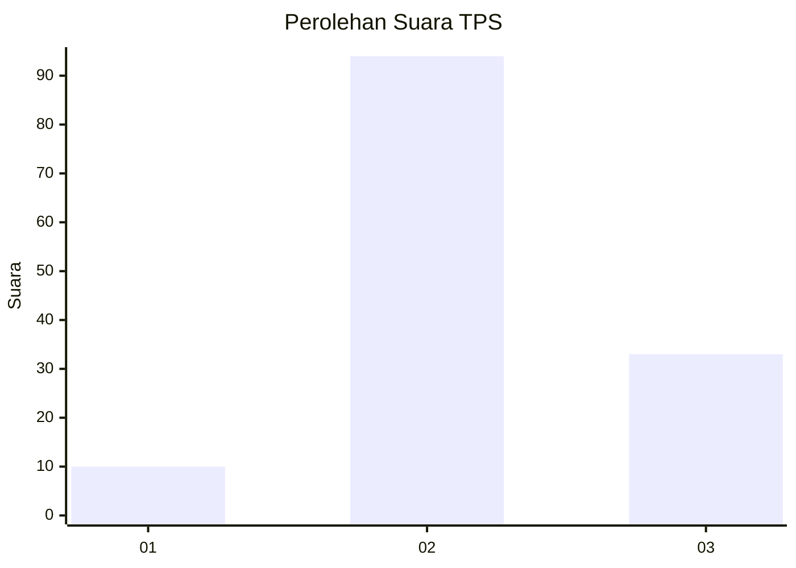
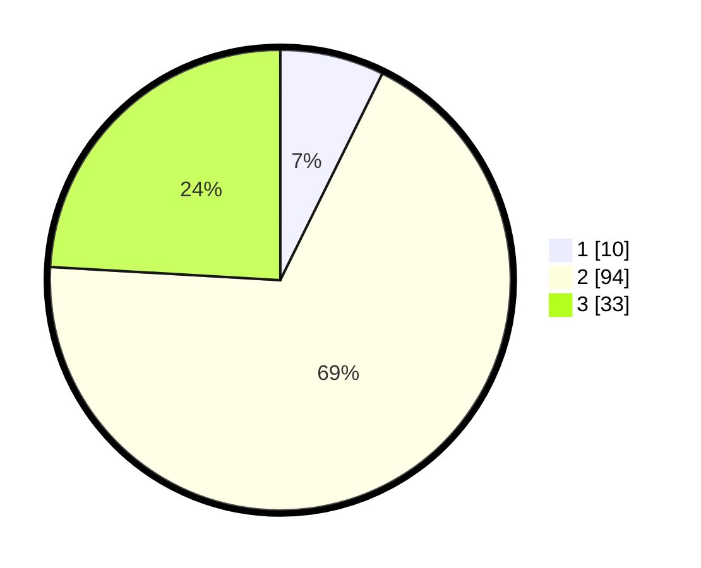

# Hasil

## Grafik

## Tabel

| No. | Nama Paslon    | Suara | Suara (raw) | Persentase |
|:--- |:-------------- | -----:| -----------:| ----------:|
| 1   | ANIES MUHAIMIN | 10    | [10][p-1]   | 7,30       |
| 2   | PRABOWO GIBRAN | 94    | [94][p-2]   | 68,61      |
| 3   | GANJAR MAHFUD  | 33    | [33][p-3]   | 24,09      |

[p-1]: https://github.com/gigit-pemilu/pemilu-2024/blob/main/pilpres/hitung-suara/sub/63-kalimantan-selatan/sub/10-tanah-bumbu/sub/01-batu-licin/sub/1007-batulicin/sub/003-tps/sub/paslon-1.txt
[p-2]: https://github.com/gigit-pemilu/pemilu-2024/blob/main/pilpres/hitung-suara/sub/63-kalimantan-selatan/sub/10-tanah-bumbu/sub/01-batu-licin/sub/1007-batulicin/sub/003-tps/sub/paslon-2.txt
[p-3]: https://github.com/gigit-pemilu/pemilu-2024/blob/main/pilpres/hitung-suara/sub/63-kalimantan-selatan/sub/10-tanah-bumbu/sub/01-batu-licin/sub/1007-batulicin/sub/003-tps/sub/paslon-3.txt

## Foto C Plano

https://sirekap-obj-formc.kpu.go.id/4481/pemilu/ppwp/63/10/01/10/07/6310011007003-20240218-210533--9931a65b-84b3-41b7-9c63-475f439e33ee.jpg

https://sirekap-obj-formc.kpu.go.id/4481/pemilu/ppwp/63/10/01/10/07/6310011007003-20240214-213814--471c2cc4-04ab-46f1-8ec3-f207c2b80036.jpg

https://sirekap-obj-formc.kpu.go.id/4481/pemilu/ppwp/63/10/01/10/07/6310011007003-20240214-213710--75c3e79a-ed49-470b-9a64-df0257c4fdd3.jpg

## Metadata

| Key        | Value               |
| ---------- | ------------------- |
| Time Stamp | 2024-02-19 06:16:00 |

