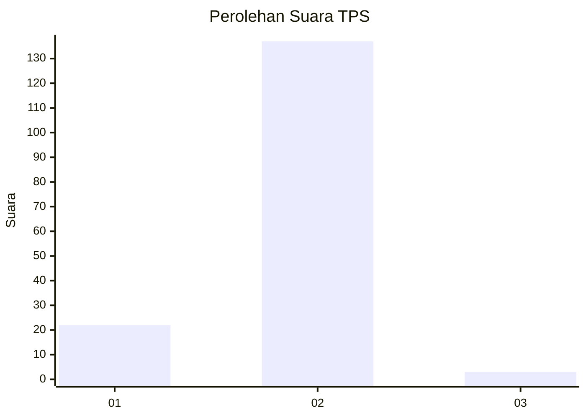
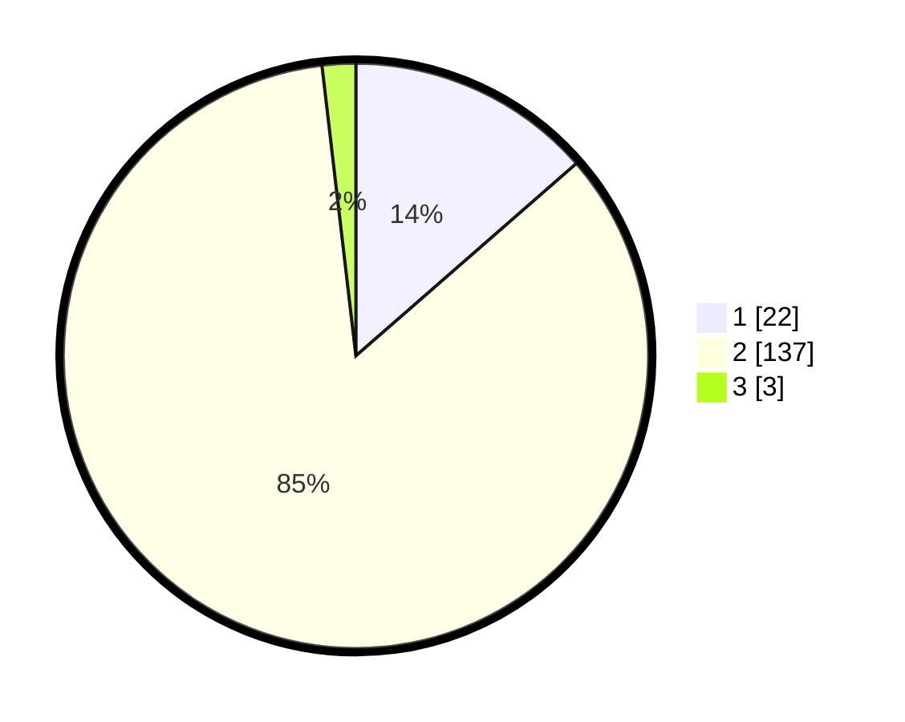

# Hasil

## Grafik

## Tabel

| No. | Nama Paslon    | Suara | Suara (raw) | Persentase |
|:--- |:-------------- | -----:| -----------:| ----------:|
| 1   | ANIES MUHAIMIN | 22    | [22][p-1]   | 13,58      |
| 2   | PRABOWO GIBRAN | 137   | [137][p-2]  | 84,57      |
| 3   | GANJAR MAHFUD  | 3     | [3][p-3]    | 1,85       |

[p-1]: https://github.com/gigit-pemilu/pemilu-2024-63-kalimantan-selatan/blob/main/pilpres/hitung-suara/sub/63-kalimantan-selatan/sub/10-tanah-bumbu/sub/04-satui/sub/2003-setarap/sub/002-tps/sub/paslon-1.txt
[p-2]: https://github.com/gigit-pemilu/pemilu-2024-63-kalimantan-selatan/blob/main/pilpres/hitung-suara/sub/63-kalimantan-selatan/sub/10-tanah-bumbu/sub/04-satui/sub/2003-setarap/sub/002-tps/sub/paslon-2.txt
[p-3]: https://github.com/gigit-pemilu/pemilu-2024-63-kalimantan-selatan/blob/main/pilpres/hitung-suara/sub/63-kalimantan-selatan/sub/10-tanah-bumbu/sub/04-satui/sub/2003-setarap/sub/002-tps/sub/paslon-3.txt

## Foto C Plano

https://sirekap-obj-formc.kpu.go.id/2f97/pemilu/ppwp/63/10/04/20/03/6310042003002-20240215-033649--b236df05-e148-4478-b53a-1b801f5b469f.jpg

https://sirekap-obj-formc.kpu.go.id/2f97/pemilu/ppwp/63/10/04/20/03/6310042003002-20240215-033837--be0e8c8f-efaa-414d-99cc-492a37cb44b1.jpg

https://sirekap-obj-formc.kpu.go.id/2f97/pemilu/ppwp/63/10/04/20/03/6310042003002-20240215-033947--b5c8c480-ed49-4949-a211-59ee1eb09087.jpg

## Metadata

| Key        | Value               |
| ---------- | ------------------- |
| Time Stamp | 2024-02-15 23:29:50 |

