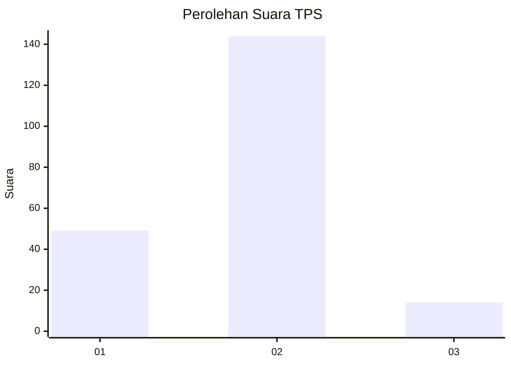
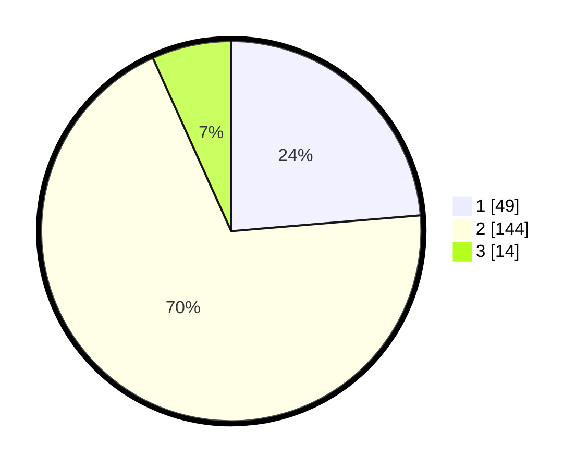

# Hasil

## Grafik

## Tabel

| No. | Nama Paslon    | Suara | Suara (raw) | Persentase |
|:--- |:-------------- | -----:| -----------:| ----------:|
| 1   | ANIES MUHAIMIN | 49    | [49][p-1]   | 23,67      |
| 2   | PRABOWO GIBRAN | 144   | [144][p-2]  | 69,57      |
| 3   | GANJAR MAHFUD  | 14    | [14][p-3]   | 6,76       |

[p-1]: https://github.com/gigit-pemilu/pemilu-2024-63-kalimantan-selatan/blob/main/pilpres/hitung-suara/sub/63-kalimantan-selatan/sub/10-tanah-bumbu/sub/05-kusan-hulu/sub/2002-manuntung/sub/002-tps/sub/paslon-1.txt
[p-2]: https://github.com/gigit-pemilu/pemilu-2024-63-kalimantan-selatan/blob/main/pilpres/hitung-suara/sub/63-kalimantan-selatan/sub/10-tanah-bumbu/sub/05-kusan-hulu/sub/2002-manuntung/sub/002-tps/sub/paslon-2.txt
[p-3]: https://github.com/gigit-pemilu/pemilu-2024-63-kalimantan-selatan/blob/main/pilpres/hitung-suara/sub/63-kalimantan-selatan/sub/10-tanah-bumbu/sub/05-kusan-hulu/sub/2002-manuntung/sub/002-tps/sub/paslon-3.txt

## Foto C Plano

https://sirekap-obj-formc.kpu.go.id/865e/pemilu/ppwp/63/10/05/20/02/6310052002002-20240216-090330--522beadc-7322-4548-a54b-1196c02c220a.jpg

https://sirekap-obj-formc.kpu.go.id/865e/pemilu/ppwp/63/10/05/20/02/6310052002002-20240215-093602--3baf7b9a-1fbb-4320-b4ef-cf2e0a04cb37.jpg

https://sirekap-obj-formc.kpu.go.id/865e/pemilu/ppwp/63/10/05/20/02/6310052002002-20240215-093715--0d8604a6-3894-4dff-9141-7c51a2f95234.jpg

## Metadata

| Key        | Value               |
| ---------- | ------------------- |
| Time Stamp | 2024-02-16 09:30:28 |

