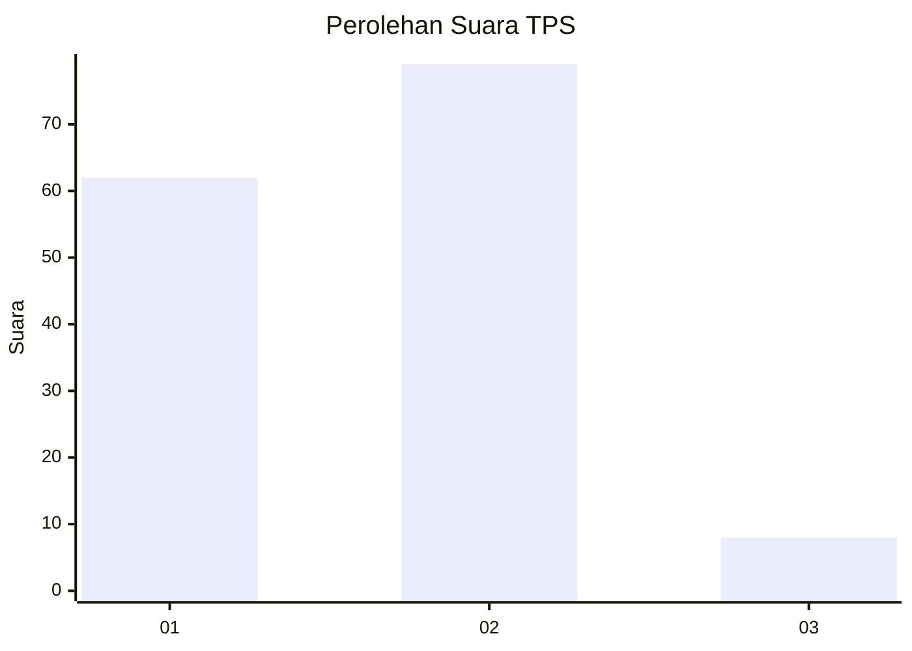
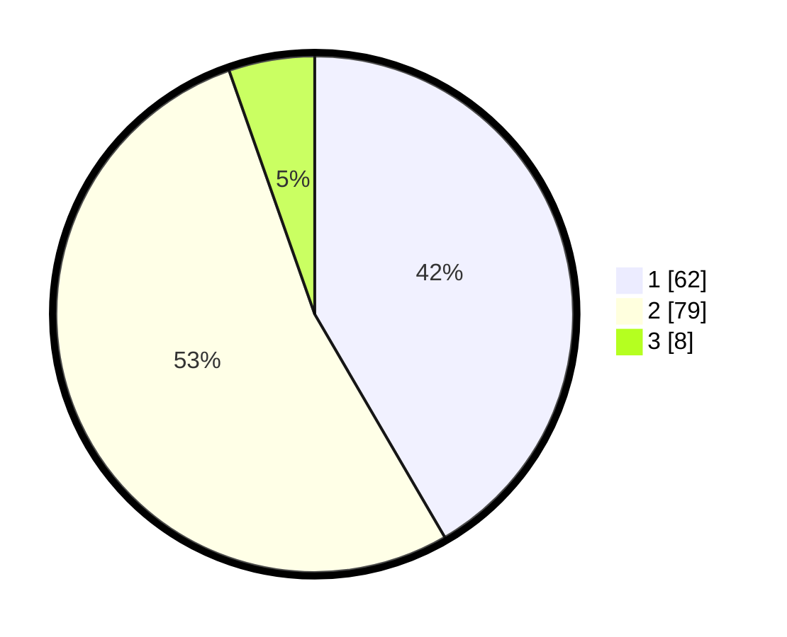

# Hasil

## Grafik

## Tabel

| No. | Nama Paslon    | Suara | Suara (raw) | Persentase |
|:--- |:-------------- | -----:| -----------:| ----------:|
| 1   | ANIES MUHAIMIN | 62    | [62][p-1]   | 41,61      |
| 2   | PRABOWO GIBRAN | 79    | [79][p-2]   | 53,02      |
| 3   | GANJAR MAHFUD  | 8     | [8][p-3]    | 5,37       |

[p-1]: https://github.com/gigit-pemilu/pemilu-2024/blob/main/pilpres/hitung-suara/sub/63-kalimantan-selatan/sub/10-tanah-bumbu/sub/06-simpang-empat/sub/1001-kampung-baru/sub/002-tps/sub/paslon-1.txt
[p-2]: https://github.com/gigit-pemilu/pemilu-2024/blob/main/pilpres/hitung-suara/sub/63-kalimantan-selatan/sub/10-tanah-bumbu/sub/06-simpang-empat/sub/1001-kampung-baru/sub/002-tps/sub/paslon-2.txt
[p-3]: https://github.com/gigit-pemilu/pemilu-2024/blob/main/pilpres/hitung-suara/sub/63-kalimantan-selatan/sub/10-tanah-bumbu/sub/06-simpang-empat/sub/1001-kampung-baru/sub/002-tps/sub/paslon-3.txt

## Foto C Plano

https://sirekap-obj-formc.kpu.go.id/aac2/pemilu/ppwp/63/10/06/10/01/6310061001002-20240218-145139--f973bd13-3f67-41aa-a894-d9bbb18e16d7.jpg

https://sirekap-obj-formc.kpu.go.id/aac2/pemilu/ppwp/63/10/06/10/01/6310061001002-20240218-144827--3f149043-02e1-42d8-b330-fb76e944bf4e.jpg

https://sirekap-obj-formc.kpu.go.id/aac2/pemilu/ppwp/63/10/06/10/01/6310061001002-20240218-144954--eb7eeee6-1479-4f86-9ee8-6edabeede52e.jpg

## Metadata

| Key        | Value               |
| ---------- | ------------------- |
| Time Stamp | 2024-02-24 22:31:28 |

