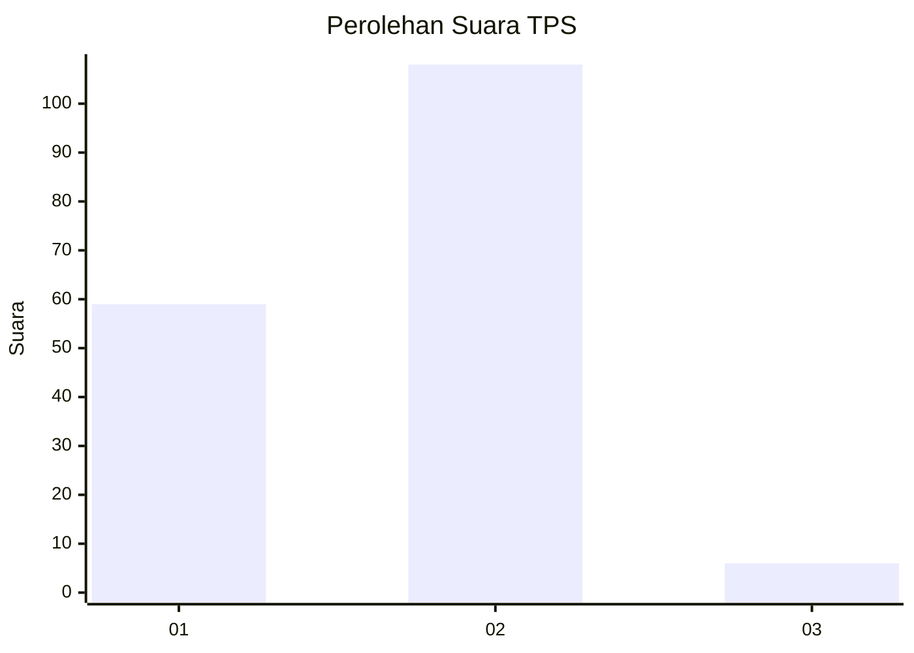
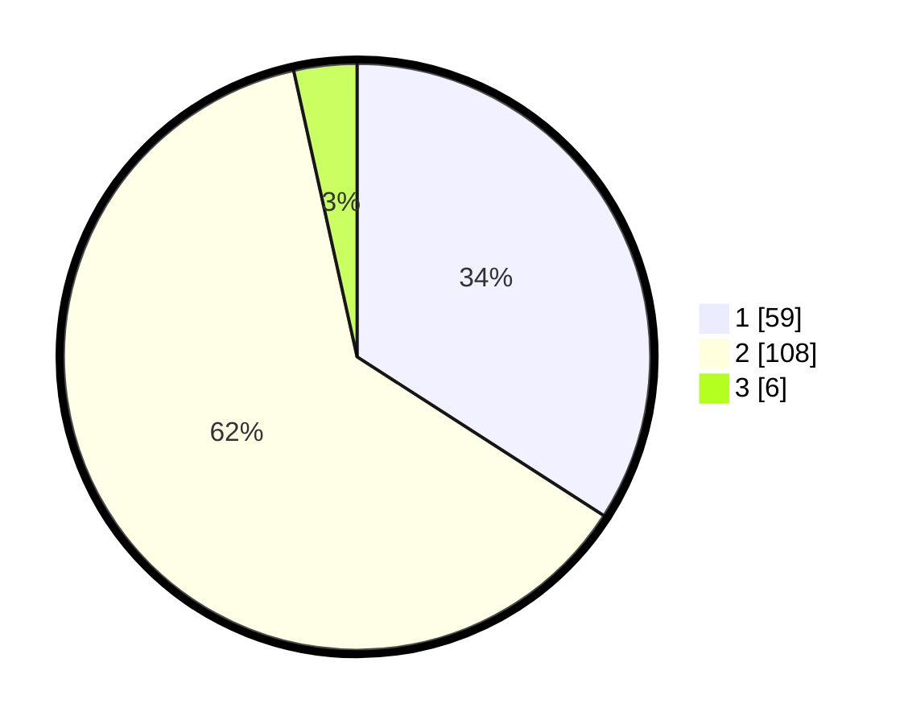

# Hasil

## Grafik

## Tabel

| No. | Nama Paslon    | Suara | Suara (raw) | Persentase |
|:--- |:-------------- | -----:| -----------:| ----------:|
| 1   | ANIES MUHAIMIN | 59    | [59][p-1]   | 34,10      |
| 2   | PRABOWO GIBRAN | 108   | [108][p-2]  | 62,43      |
| 3   | GANJAR MAHFUD  | 6     | [6][p-3]    | 3,47       |

[p-1]: https://github.com/gigit-pemilu/pemilu-2024/blob/main/pilpres/hitung-suara/sub/63-kalimantan-selatan/sub/10-tanah-bumbu/sub/06-simpang-empat/sub/1001-kampung-baru/sub/020-tps/sub/paslon-1.txt
[p-2]: https://github.com/gigit-pemilu/pemilu-2024/blob/main/pilpres/hitung-suara/sub/63-kalimantan-selatan/sub/10-tanah-bumbu/sub/06-simpang-empat/sub/1001-kampung-baru/sub/020-tps/sub/paslon-2.txt
[p-3]: https://github.com/gigit-pemilu/pemilu-2024/blob/main/pilpres/hitung-suara/sub/63-kalimantan-selatan/sub/10-tanah-bumbu/sub/06-simpang-empat/sub/1001-kampung-baru/sub/020-tps/sub/paslon-3.txt

## Foto C Plano

https://sirekap-obj-formc.kpu.go.id/1cf3/pemilu/ppwp/63/10/06/10/01/6310061001020-20240215-212802--e2f2b633-b3a7-44ec-baf1-7e684da6e081.jpg

https://sirekap-obj-formc.kpu.go.id/1cf3/pemilu/ppwp/63/10/06/10/01/6310061001020-20240215-212551--f23b2a6e-363c-49cd-86b1-ac2c2a6d0a18.jpg

https://sirekap-obj-formc.kpu.go.id/1cf3/pemilu/ppwp/63/10/06/10/01/6310061001020-20240215-212204--e9e4095c-857f-4655-ba86-d7c598e83c0a.jpg

## Metadata

| Key        | Value               |
| ---------- | ------------------- |
| Time Stamp | 2024-02-15 22:30:27 |

