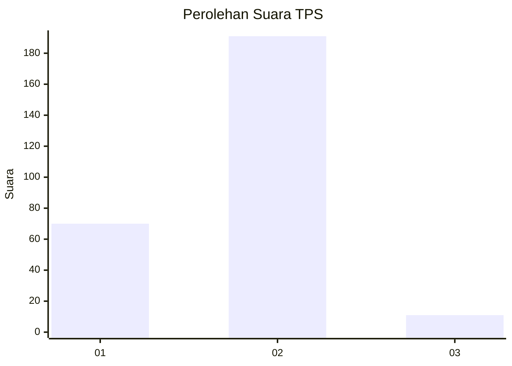
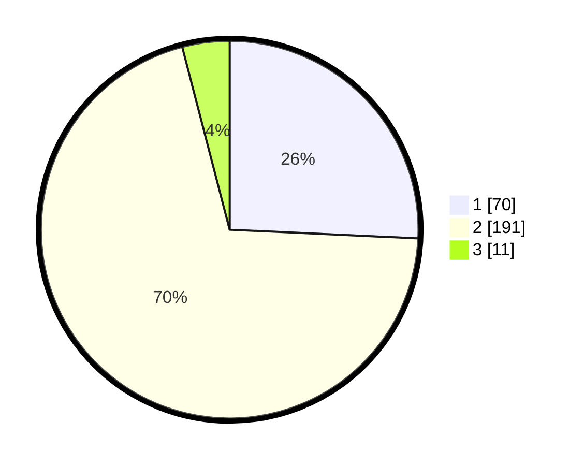

# Hasil

## Grafik

## Tabel

| No. | Nama Paslon    | Suara | Suara (raw) | Persentase |
|:--- |:-------------- | -----:| -----------:| ----------:|
| 1   | ANIES MUHAIMIN | 70    | [70][p-1]   | 25,74      |
| 2   | PRABOWO GIBRAN | 191   | [191][p-2]  | 70,22      |
| 3   | GANJAR MAHFUD  | 11    | [11][p-3]   | 4,04       |

[p-1]: https://github.com/gigit-pemilu/pemilu-2024-63-kalimantan-selatan/blob/main/pilpres/hitung-suara/sub/63-kalimantan-selatan/sub/10-tanah-bumbu/sub/06-simpang-empat/sub/1002-tungkaran-pangeran/sub/010-tps/sub/paslon-1.txt
[p-2]: https://github.com/gigit-pemilu/pemilu-2024-63-kalimantan-selatan/blob/main/pilpres/hitung-suara/sub/63-kalimantan-selatan/sub/10-tanah-bumbu/sub/06-simpang-empat/sub/1002-tungkaran-pangeran/sub/010-tps/sub/paslon-2.txt
[p-3]: https://github.com/gigit-pemilu/pemilu-2024-63-kalimantan-selatan/blob/main/pilpres/hitung-suara/sub/63-kalimantan-selatan/sub/10-tanah-bumbu/sub/06-simpang-empat/sub/1002-tungkaran-pangeran/sub/010-tps/sub/paslon-3.txt

## Foto C Plano

https://sirekap-obj-formc.kpu.go.id/1407/pemilu/ppwp/63/10/06/10/02/6310061002010-20240215-190706--8005e51f-9a59-4821-b4ea-692dad4ef000.jpg

https://sirekap-obj-formc.kpu.go.id/1407/pemilu/ppwp/63/10/06/10/02/6310061002010-20240215-031603--8b8d85e1-6187-4696-818d-b04408a435bd.jpg

https://sirekap-obj-formc.kpu.go.id/1407/pemilu/ppwp/63/10/06/10/02/6310061002010-20240215-031620--8cad9f9b-c9d1-4336-8928-d68c140a3403.jpg

## Metadata

| Key        | Value               |
| ---------- | ------------------- |
| Time Stamp | 2024-02-16 21:01:00 |

