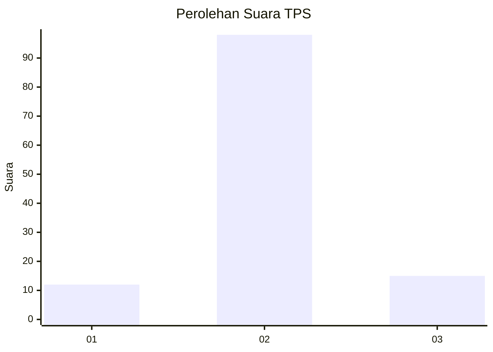
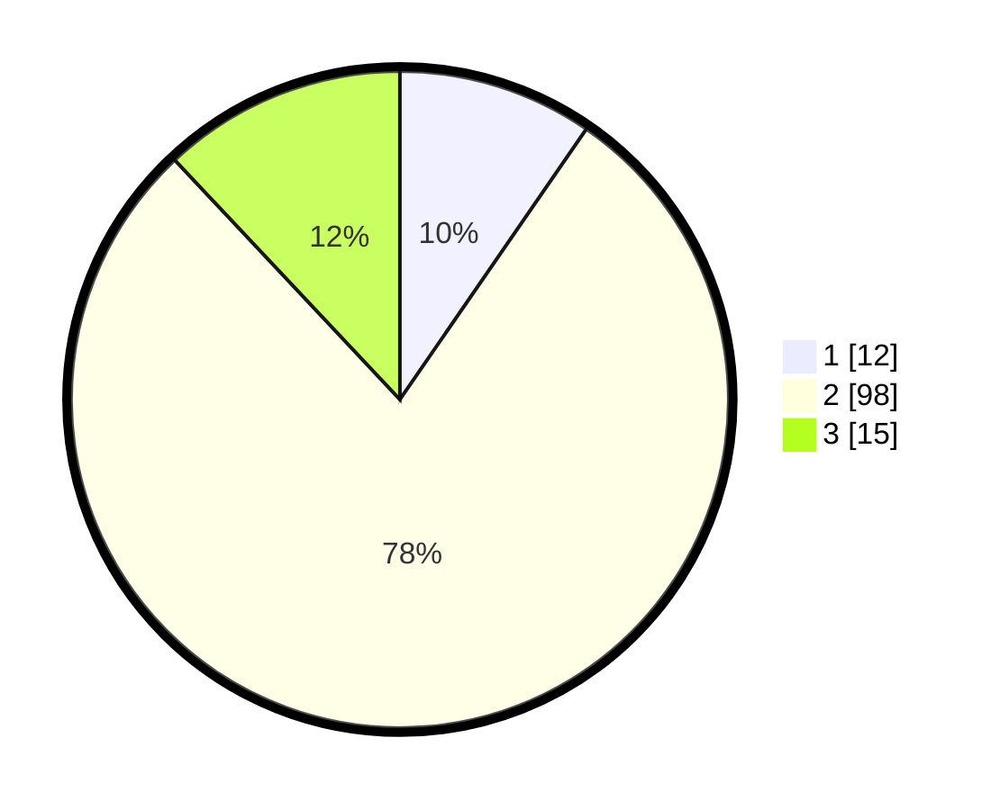

# Hasil

## Grafik

## Tabel

| No. | Nama Paslon    | Suara | Suara (raw) | Persentase |
|:--- |:-------------- | -----:| -----------:| ----------:|
| 1   | ANIES MUHAIMIN | 12    | [12][p-1]   | 9,60       |
| 2   | PRABOWO GIBRAN | 98    | [98][p-2]   | 78,40      |
| 3   | GANJAR MAHFUD  | 15    | [15][p-3]   | 12,00      |

[p-1]: https://github.com/gigit-pemilu/pemilu-2024/blob/main/pilpres/hitung-suara/sub/63-kalimantan-selatan/sub/10-tanah-bumbu/sub/08-mantewe/sub/2001-mantewe/sub/009-tps/sub/paslon-1.txt
[p-2]: https://github.com/gigit-pemilu/pemilu-2024/blob/main/pilpres/hitung-suara/sub/63-kalimantan-selatan/sub/10-tanah-bumbu/sub/08-mantewe/sub/2001-mantewe/sub/009-tps/sub/paslon-2.txt
[p-3]: https://github.com/gigit-pemilu/pemilu-2024/blob/main/pilpres/hitung-suara/sub/63-kalimantan-selatan/sub/10-tanah-bumbu/sub/08-mantewe/sub/2001-mantewe/sub/009-tps/sub/paslon-3.txt

## Foto C Plano

https://sirekap-obj-formc.kpu.go.id/a33f/pemilu/ppwp/63/10/08/20/01/6310082001009-20240214-141015--adceba43-4249-40db-8980-5e7e3647622f.jpg

https://sirekap-obj-formc.kpu.go.id/a33f/pemilu/ppwp/63/10/08/20/01/6310082001009-20240214-231149--0b34a87c-ed80-4da9-b2bd-fd87846795ee.jpg

https://sirekap-obj-formc.kpu.go.id/a33f/pemilu/ppwp/63/10/08/20/01/6310082001009-20240214-141102--56bc688a-f9b9-450d-b084-b416cbd1dbb8.jpg

## Metadata

| Key        | Value               |
| ---------- | ------------------- |
| Time Stamp | 2024-02-16 16:25:10 |

