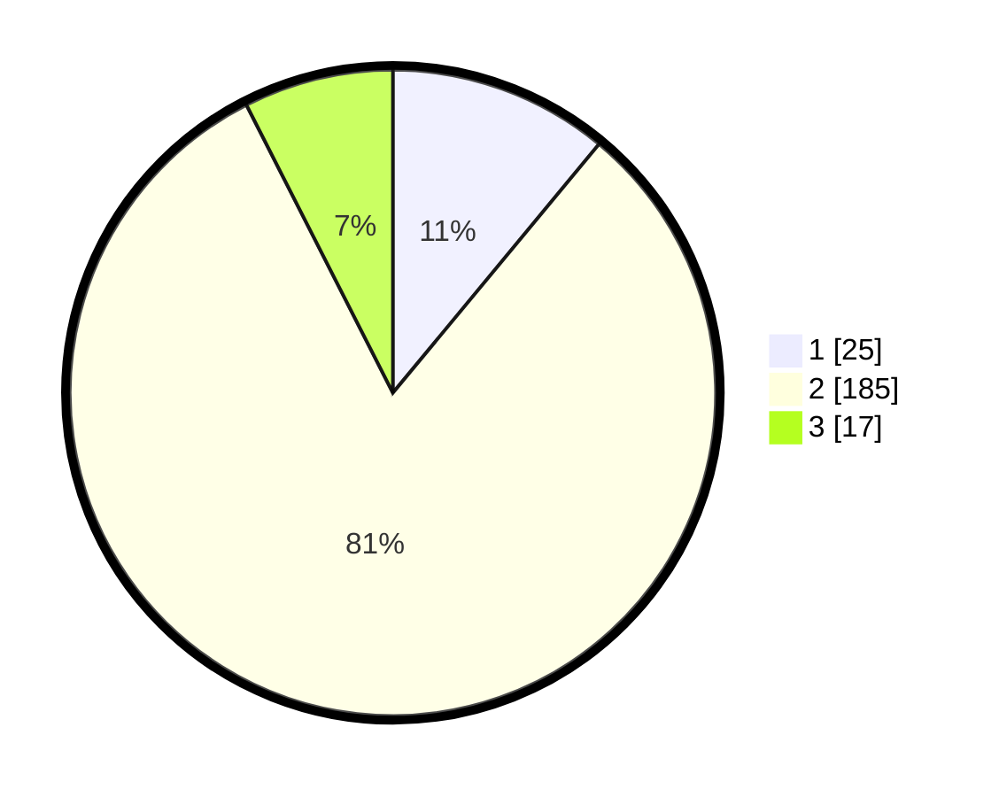

# Hasil

## Grafik

## Tabel

| No. | Nama Paslon    | Suara | Suara (raw) | Persentase |
|:--- |:-------------- | -----:| -----------:| ----------:|
| 1   | ANIES MUHAIMIN | 25    | [25][p-1]   | 11,01      |
| 2   | PRABOWO GIBRAN | 185   | [185][p-2]  | 81,50      |
| 3   | GANJAR MAHFUD  | 17    | [17][p-3]   | 7,49       |

[p-1]: https://github.com/gigit-pemilu/pemilu-2024/blob/main/pilpres/hitung-suara/sub/63-kalimantan-selatan/sub/10-tanah-bumbu/sub/10-kuranji/sub/2001-giri-mulya/sub/004-tps/sub/paslon-1.txt
[p-2]: https://github.com/gigit-pemilu/pemilu-2024/blob/main/pilpres/hitung-suara/sub/63-kalimantan-selatan/sub/10-tanah-bumbu/sub/10-kuranji/sub/2001-giri-mulya/sub/004-tps/sub/paslon-2.txt
[p-3]: https://github.com/gigit-pemilu/pemilu-2024/blob/main/pilpres/hitung-suara/sub/63-kalimantan-selatan/sub/10-tanah-bumbu/sub/10-kuranji/sub/2001-giri-mulya/sub/004-tps/sub/paslon-3.txt

## Foto C Plano

https://sirekap-obj-formc.kpu.go.id/519b/pemilu/ppwp/63/10/10/20/01/6310102001004-20240221-093111--5745ee15-99bb-42d6-8ab4-80e89bec3d85.jpg

https://sirekap-obj-formc.kpu.go.id/519b/pemilu/ppwp/63/10/10/20/01/6310102001004-20240221-093247--1cfc4a75-6c46-4e63-abf4-c752e4b8b5d8.jpg

https://sirekap-obj-formc.kpu.go.id/519b/pemilu/ppwp/63/10/10/20/01/6310102001004-20240221-093457--684a8c8d-434e-4759-aec4-8bdfc6294136.jpg

## Metadata

| Key        | Value               |
| ---------- | ------------------- |
| Time Stamp | 2024-02-25 23:00:00 |

