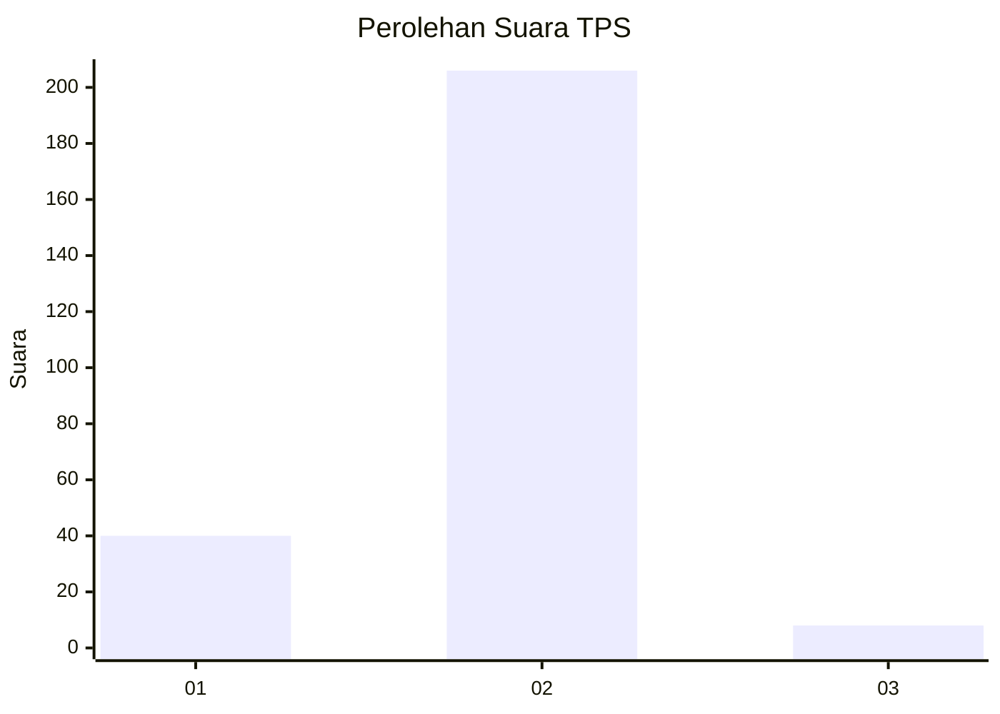
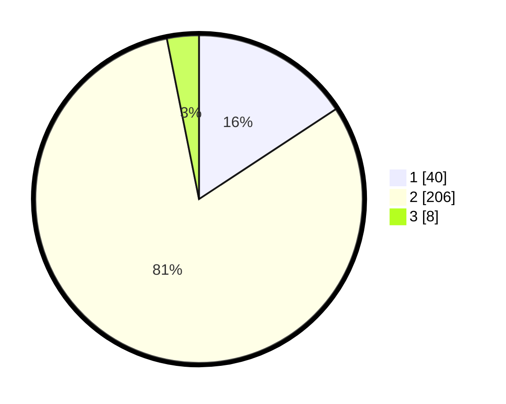

# Hasil

## Grafik

## Tabel

| No. | Nama Paslon    | Suara | Suara (raw) | Persentase |
|:--- |:-------------- | -----:| -----------:| ----------:|
| 1   | ANIES MUHAIMIN | 40    | [40][p-1]   | 15,75      |
| 2   | PRABOWO GIBRAN | 206   | [206][p-2]  | 81,10      |
| 3   | GANJAR MAHFUD  | 8     | [8][p-3]    | 3,15       |

[p-1]: https://github.com/gigit-pemilu/pemilu-2024/blob/main/pilpres/hitung-suara/sub/63-kalimantan-selatan/sub/10-tanah-bumbu/sub/11-kusan-tengah/sub/2001-saring-sungai-bubu/sub/005-tps/sub/paslon-1.txt
[p-2]: https://github.com/gigit-pemilu/pemilu-2024/blob/main/pilpres/hitung-suara/sub/63-kalimantan-selatan/sub/10-tanah-bumbu/sub/11-kusan-tengah/sub/2001-saring-sungai-bubu/sub/005-tps/sub/paslon-2.txt
[p-3]: https://github.com/gigit-pemilu/pemilu-2024/blob/main/pilpres/hitung-suara/sub/63-kalimantan-selatan/sub/10-tanah-bumbu/sub/11-kusan-tengah/sub/2001-saring-sungai-bubu/sub/005-tps/sub/paslon-3.txt

## Foto C Plano

https://sirekap-obj-formc.kpu.go.id/5151/pemilu/ppwp/63/10/11/20/01/6310112001005-20240216-215218--df787b34-1e88-4099-a074-3532d1032bca.jpg

https://sirekap-obj-formc.kpu.go.id/5151/pemilu/ppwp/63/10/11/20/01/6310112001005-20240217-110421--445bd1ef-438a-4938-9be9-e88438af98ca.jpg

https://sirekap-obj-formc.kpu.go.id/5151/pemilu/ppwp/63/10/11/20/01/6310112001005-20240216-215234--30941053-0ddd-432a-8094-95954454ee76.jpg

## Metadata

| Key        | Value               |
| ---------- | ------------------- |
| Time Stamp | 2024-02-24 22:31:28 |

