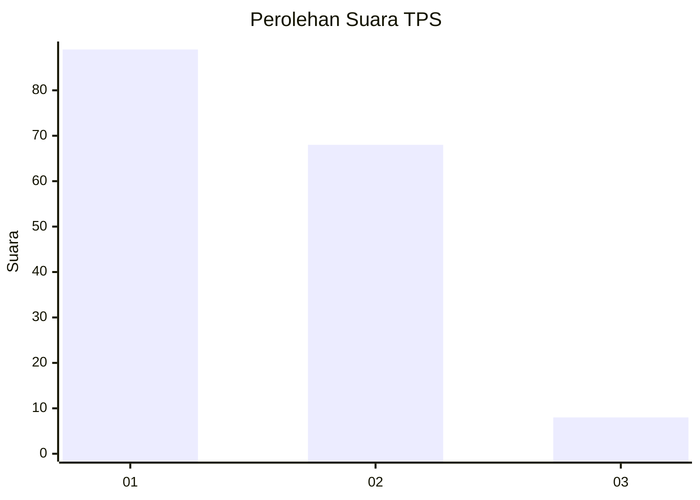
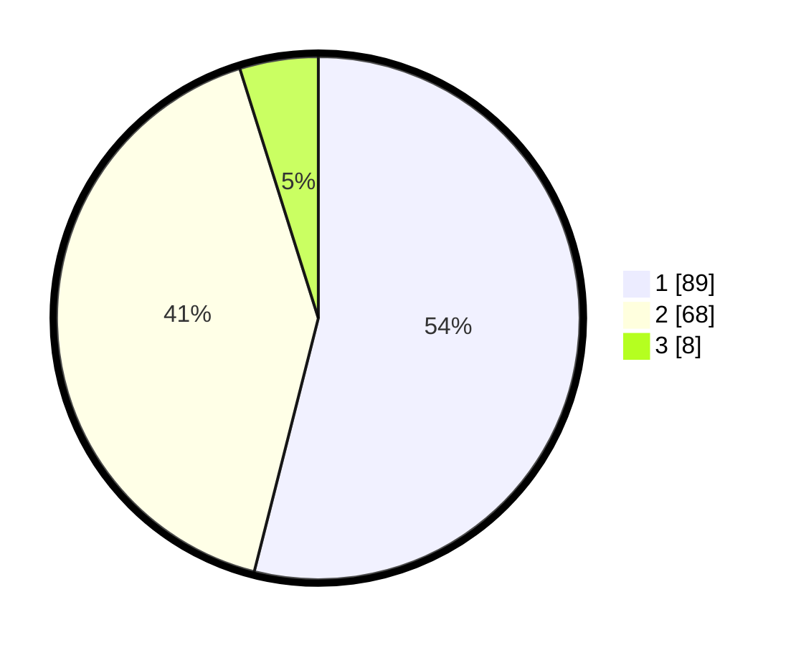

# Hasil

## Grafik

## Tabel

| No. | Nama Paslon    | Suara | Suara (raw) | Persentase |
|:--- |:-------------- | -----:| -----------:| ----------:|
| 1   | ANIES MUHAIMIN | 89    | [89][p-1]   | 53,94      |
| 2   | PRABOWO GIBRAN | 68    | [68][p-2]   | 41,21      |
| 3   | GANJAR MAHFUD  | 8     | [8][p-3]    | 4,85       |

[p-1]: https://github.com/gigit-pemilu/pemilu-2024/blob/main/pilpres/hitung-suara/sub/63-kalimantan-selatan/sub/11-balangan/sub/03-awayan/sub/2004-bihara/sub/002-tps/sub/paslon-1.txt
[p-2]: https://github.com/gigit-pemilu/pemilu-2024/blob/main/pilpres/hitung-suara/sub/63-kalimantan-selatan/sub/11-balangan/sub/03-awayan/sub/2004-bihara/sub/002-tps/sub/paslon-2.txt
[p-3]: https://github.com/gigit-pemilu/pemilu-2024/blob/main/pilpres/hitung-suara/sub/63-kalimantan-selatan/sub/11-balangan/sub/03-awayan/sub/2004-bihara/sub/002-tps/sub/paslon-3.txt

## Foto C Plano

https://sirekap-obj-formc.kpu.go.id/28b4/pemilu/ppwp/63/11/03/20/04/6311032004002-20240215-015941--8f96f026-851c-402b-893f-ce8e40e8f039.jpg

https://sirekap-obj-formc.kpu.go.id/28b4/pemilu/ppwp/63/11/03/20/04/6311032004002-20240215-044156--bbcd0a6c-87a6-4de9-9935-307b810f0cb5.jpg

https://sirekap-obj-formc.kpu.go.id/28b4/pemilu/ppwp/63/11/03/20/04/6311032004002-20240215-044358--2c0542a2-e60d-46a0-a876-c14821ddfa52.jpg

## Metadata

| Key        | Value               |
| ---------- | ------------------- |
| Time Stamp | 2024-02-15 22:40:13 |

