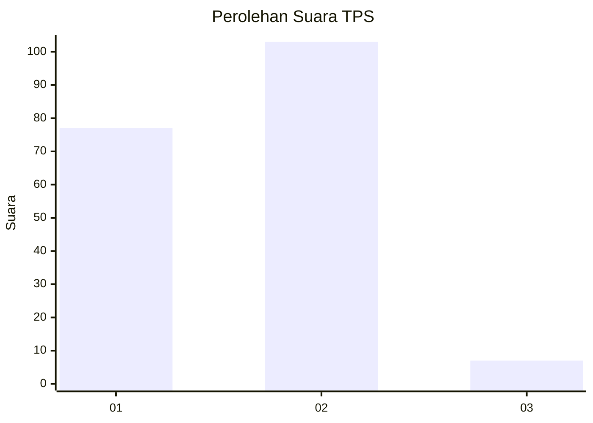
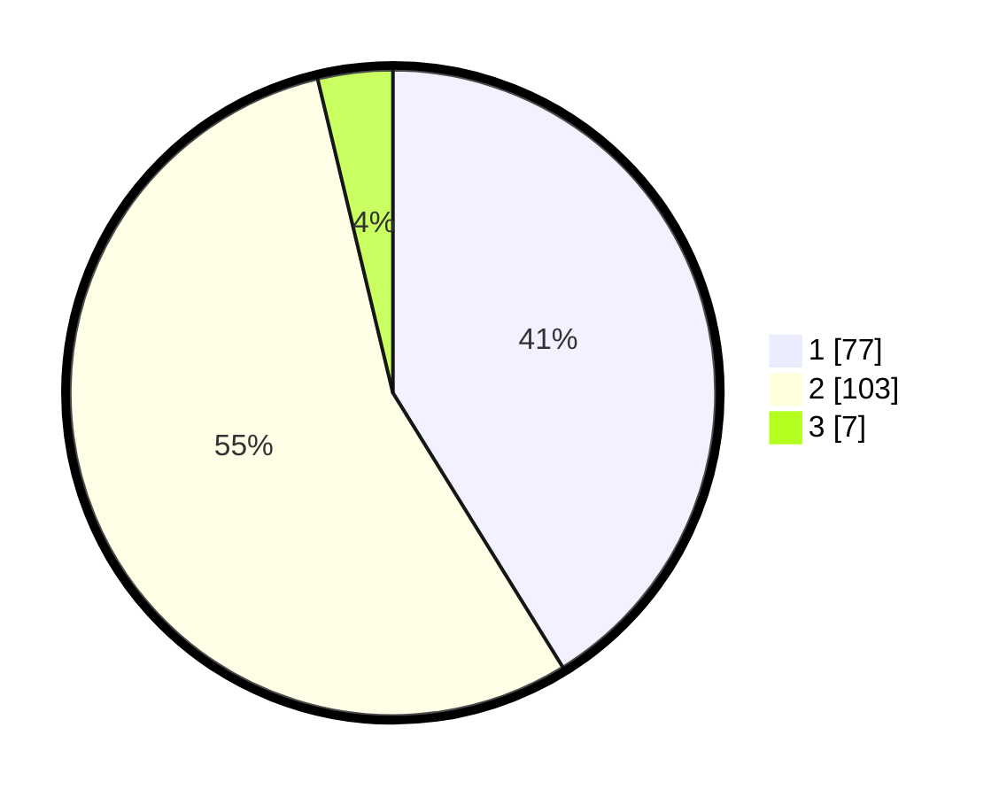

# Hasil

## Grafik

## Tabel

| No. | Nama Paslon    | Suara | Suara (raw) | Persentase |
|:--- |:-------------- | -----:| -----------:| ----------:|
| 1   | ANIES MUHAIMIN | 77    | [77][p-1]   | 41,18      |
| 2   | PRABOWO GIBRAN | 103   | [103][p-2]  | 55,08      |
| 3   | GANJAR MAHFUD  | 7     | [7][p-3]    | 3,74       |

[p-1]: https://github.com/gigit-pemilu/pemilu-2024-63-kalimantan-selatan/blob/main/pilpres/hitung-suara/sub/63-kalimantan-selatan/sub/11-balangan/sub/05-lampihong/sub/2004-batu-merah/sub/002-tps/sub/paslon-1.txt
[p-2]: https://github.com/gigit-pemilu/pemilu-2024-63-kalimantan-selatan/blob/main/pilpres/hitung-suara/sub/63-kalimantan-selatan/sub/11-balangan/sub/05-lampihong/sub/2004-batu-merah/sub/002-tps/sub/paslon-2.txt
[p-3]: https://github.com/gigit-pemilu/pemilu-2024-63-kalimantan-selatan/blob/main/pilpres/hitung-suara/sub/63-kalimantan-selatan/sub/11-balangan/sub/05-lampihong/sub/2004-batu-merah/sub/002-tps/sub/paslon-3.txt

## Foto C Plano

https://sirekap-obj-formc.kpu.go.id/e764/pemilu/ppwp/63/11/05/20/04/6311052004002-20240216-192144--957a18f6-7903-40da-852a-27c04e909e2c.jpg

https://sirekap-obj-formc.kpu.go.id/e764/pemilu/ppwp/63/11/05/20/04/6311052004002-20240217-202156--1a59ec29-7605-48ea-bbbe-2dfc3076c46a.jpg

https://sirekap-obj-formc.kpu.go.id/e764/pemilu/ppwp/63/11/05/20/04/6311052004002-20240217-202155--62041a22-c08e-4254-b809-9fe36e7ef951.jpg

## Metadata

| Key        | Value               |
| ---------- | ------------------- |
| Time Stamp | 2024-02-19 06:16:00 |

## DATA PEMILIH TETAP

Jumlah pemilih dalam DPT: **234**.
 * L: **644**.
 * P: **333**.

## DATA PENGGUNA HAK PILIH

Jumlah pengguna hak pilih dalam DPT: **344**.
 * L: **894**.
 * P: **807**.

Jumlah pengguna hak pilih dalam DPTb: **724**.
 * L: **302**.
 * P: **444**.

Jumlah pengguna hak pilih dalam DPK: **5**.
 * L: **402**.
 * P: **803**.

Jumlah pengguna hak pilih: **232**.
 * L: **43**.
 * P: **282**.

## JUMLAH SUARA SAH DAN TIDAK SAH

JUMLAH SELURUH SUARA SAH: **187**.

JUMLAH SUARA TIDAK SAH: **21**.

JUMLAH SELURUH SUARA SAH DAN SUARA TIDAK SAH: **208**.

