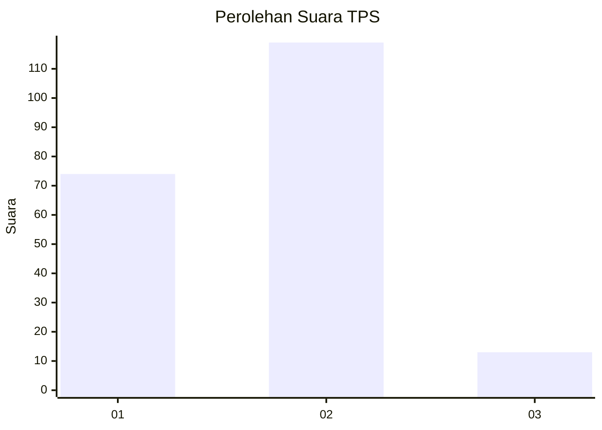
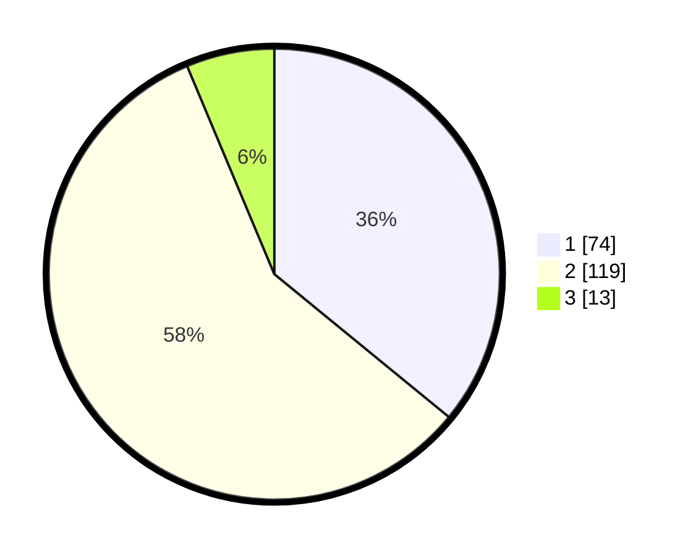

# Hasil

## Grafik

## Tabel

| No. | Nama Paslon    | Suara | Suara (raw) | Persentase |
|:--- |:-------------- | -----:| -----------:| ----------:|
| 1   | ANIES MUHAIMIN | 74    | [74][p-1]   | 35,92      |
| 2   | PRABOWO GIBRAN | 119   | [119][p-2]  | 57,77      |
| 3   | GANJAR MAHFUD  | 13    | [13][p-3]   | 6,31       |

[p-1]: https://github.com/gigit-pemilu/pemilu-2024/blob/main/pilpres/hitung-suara/sub/63-kalimantan-selatan/sub/11-balangan/sub/06-paringin/sub/1019-paringin-timur/sub/002-tps/sub/paslon-1.txt
[p-2]: https://github.com/gigit-pemilu/pemilu-2024/blob/main/pilpres/hitung-suara/sub/63-kalimantan-selatan/sub/11-balangan/sub/06-paringin/sub/1019-paringin-timur/sub/002-tps/sub/paslon-2.txt
[p-3]: https://github.com/gigit-pemilu/pemilu-2024/blob/main/pilpres/hitung-suara/sub/63-kalimantan-selatan/sub/11-balangan/sub/06-paringin/sub/1019-paringin-timur/sub/002-tps/sub/paslon-3.txt

## Foto C Plano

https://sirekap-obj-formc.kpu.go.id/d03a/pemilu/ppwp/63/11/06/10/19/6311061019002-20240217-132731--f325580a-1b91-41ee-988d-66c060e5185f.jpg

https://sirekap-obj-formc.kpu.go.id/d03a/pemilu/ppwp/63/11/06/10/19/6311061019002-20240214-190729--7584895c-7378-40af-a25a-d6cfb1e9a157.jpg

https://sirekap-obj-formc.kpu.go.id/d03a/pemilu/ppwp/63/11/06/10/19/6311061019002-20240214-191056--abedd72c-e6f4-4f80-b580-bf8fbf40f4d0.jpg

## Metadata

| Key        | Value               |
| ---------- | ------------------- |
| Time Stamp | 2024-02-17 13:37:34 |

