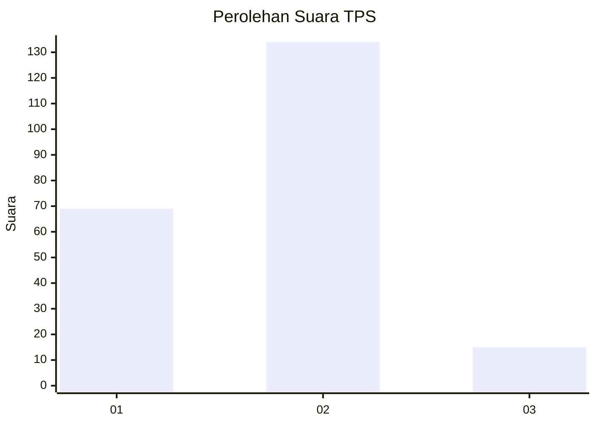
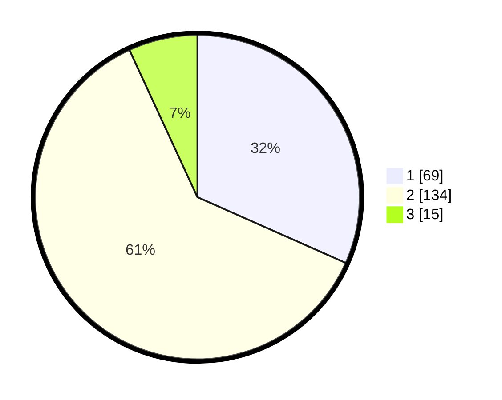

# Hasil

## Grafik

## Tabel

| No. | Nama Paslon    | Suara | Suara (raw) | Persentase |
|:--- |:-------------- | -----:| -----------:| ----------:|
| 1   | ANIES MUHAIMIN | 69    | [69][p-1]   | 31,65      |
| 2   | PRABOWO GIBRAN | 134   | [134][p-2]  | 61,47      |
| 3   | GANJAR MAHFUD  | 15    | [15][p-3]   | 6,88       |

[p-1]: https://github.com/gigit-pemilu/pemilu-2024/blob/main/pilpres/hitung-suara/sub/63-kalimantan-selatan/sub/11-balangan/sub/07-paringin-selatan/sub/1001-batu-piring/sub/007-tps/sub/paslon-1.txt
[p-2]: https://github.com/gigit-pemilu/pemilu-2024/blob/main/pilpres/hitung-suara/sub/63-kalimantan-selatan/sub/11-balangan/sub/07-paringin-selatan/sub/1001-batu-piring/sub/007-tps/sub/paslon-2.txt
[p-3]: https://github.com/gigit-pemilu/pemilu-2024/blob/main/pilpres/hitung-suara/sub/63-kalimantan-selatan/sub/11-balangan/sub/07-paringin-selatan/sub/1001-batu-piring/sub/007-tps/sub/paslon-3.txt

## Foto C Plano

https://sirekap-obj-formc.kpu.go.id/dca5/pemilu/ppwp/63/11/07/10/01/6311071001007-20240215-105910--bacacfcc-6939-4c36-83b7-94cbe33d0691.jpg

https://sirekap-obj-formc.kpu.go.id/dca5/pemilu/ppwp/63/11/07/10/01/6311071001007-20240215-105955--83da6fd6-ad6a-4e79-8f1f-03f5064f638b.jpg

https://sirekap-obj-formc.kpu.go.id/dca5/pemilu/ppwp/63/11/07/10/01/6311071001007-20240215-110116--447b8524-f2c0-4824-ba8c-ca51c99f6a26.jpg

## Metadata

| Key        | Value               |
| ---------- | ------------------- |
| Time Stamp | 2024-02-15 23:29:50 |

