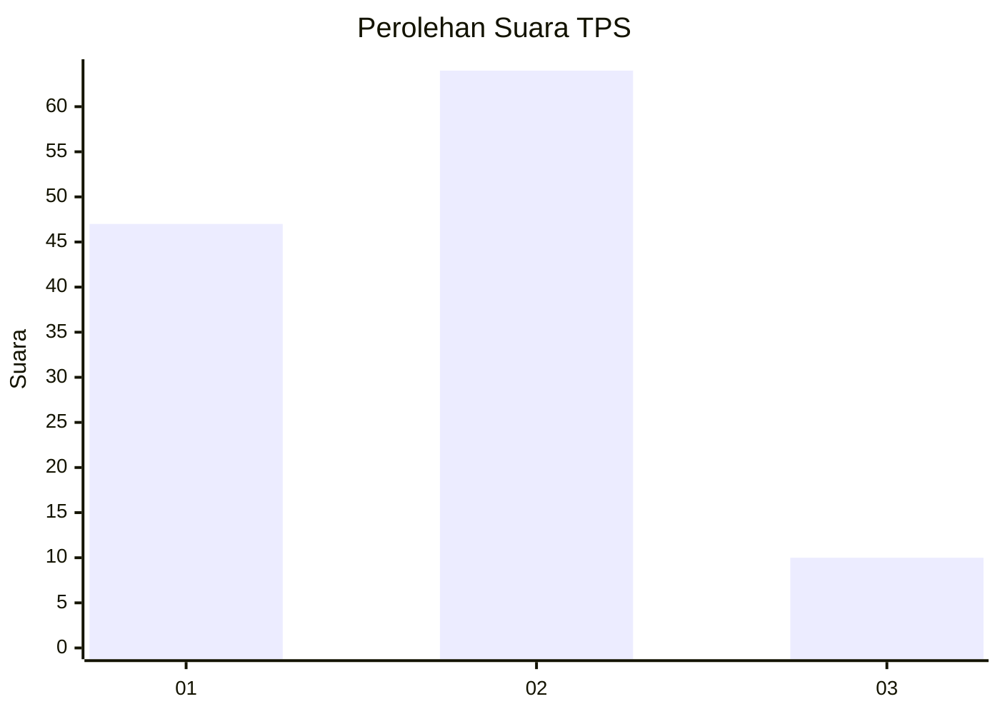

# Hasil

## Grafik

## Tabel

| No. | Nama Paslon    | Suara | Suara (raw) | Persentase |
|:--- |:-------------- | -----:| -----------:| ----------:|
| 1   | ANIES MUHAIMIN | 47    | [47][p-1]   | 38,84      |
| 2   | PRABOWO GIBRAN | 64    | [64][p-2]   | 52,89      |
| 3   | GANJAR MAHFUD  | 10    | [10][p-3]   | 8,26       |

[p-1]: https://github.com/gigit-pemilu/pemilu-2024/blob/main/pilpres/hitung-suara/sub/63-kalimantan-selatan/sub/11-balangan/sub/08-tebing-tinggi/sub/2002-tebing-tinggi/sub/002-tps/sub/paslon-1.txt
[p-2]: https://github.com/gigit-pemilu/pemilu-2024/blob/main/pilpres/hitung-suara/sub/63-kalimantan-selatan/sub/11-balangan/sub/08-tebing-tinggi/sub/2002-tebing-tinggi/sub/002-tps/sub/paslon-2.txt
[p-3]: https://github.com/gigit-pemilu/pemilu-2024/blob/main/pilpres/hitung-suara/sub/63-kalimantan-selatan/sub/11-balangan/sub/08-tebing-tinggi/sub/2002-tebing-tinggi/sub/002-tps/sub/paslon-3.txt

## Foto C Plano

https://sirekap-obj-formc.kpu.go.id/8553/pemilu/ppwp/63/11/08/20/02/6311082002002-20240217-093518--bad2ea16-bb8a-4a40-8622-1228e2dfd088.jpg

https://sirekap-obj-formc.kpu.go.id/8553/pemilu/ppwp/63/11/08/20/02/6311082002002-20240217-093649--d55793f2-da2f-45f5-8c1e-0df296ebf50a.jpg

https://sirekap-obj-formc.kpu.go.id/8553/pemilu/ppwp/63/11/08/20/02/6311082002002-20240217-093733--1daad1c8-8b91-4188-bacd-dc8f715e6205.jpg

## Metadata

| Key        | Value               |
| ---------- | ------------------- |
| Time Stamp | 2024-02-17 10:00:02 |

## DATA PEMILIH TETAP

Jumlah pemilih dalam DPT: **265**.
 * L: **138**.
 * P: **125**.

## DATA PENGGUNA HAK PILIH

Jumlah pengguna hak pilih dalam DPT: **231**.
 * L: **158**.
 * P: **837**.

Jumlah pengguna hak pilih dalam DPTb: **8**.
 * L: **81**.
 * P: **800**.

Jumlah pengguna hak pilih dalam DPK: **3**.
 * L: **881**.
 * P: **82**.

Jumlah pengguna hak pilih: **235**.
 * L: **116**.
 * P: **159**.

## JUMLAH SUARA SAH DAN TIDAK SAH

JUMLAH SELURUH SUARA SAH: **225**.

JUMLAH SUARA TIDAK SAH: **10**.

JUMLAH SELURUH SUARA SAH DAN SUARA TIDAK SAH: **235**.

