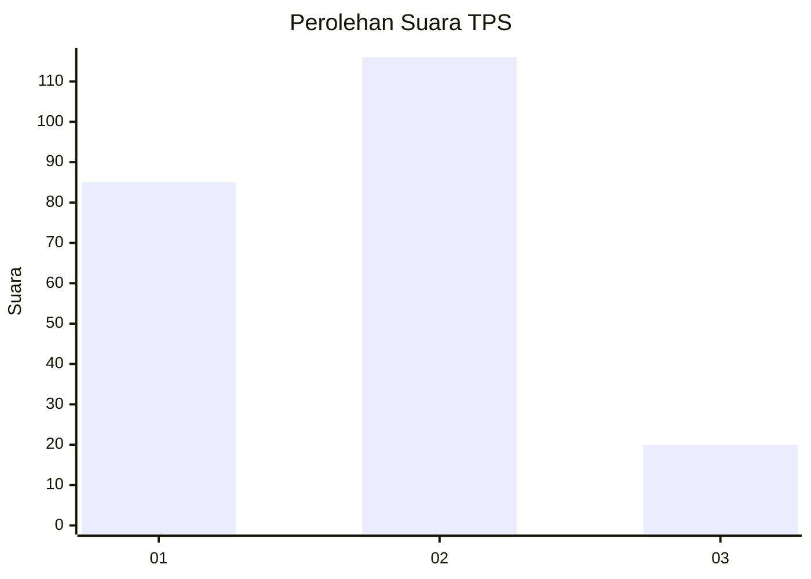
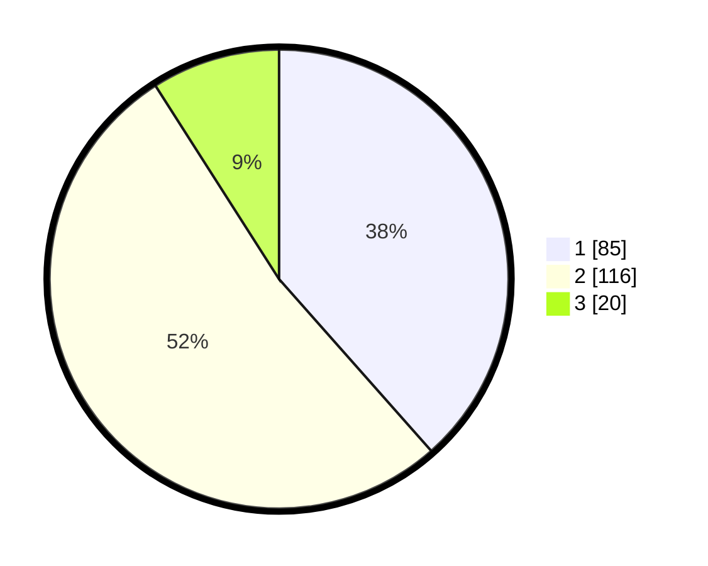

# Hasil

## Grafik

## Tabel

| No. | Nama Paslon    | Suara | Suara (raw) | Persentase |
|:--- |:-------------- | -----:| -----------:| ----------:|
| 1   | ANIES MUHAIMIN | 85    | [85][p-1]   | 38,46      |
| 2   | PRABOWO GIBRAN | 116   | [116][p-2]  | 52,49      |
| 3   | GANJAR MAHFUD  | 20    | [20][p-3]   | 9,05       |

[p-1]: https://github.com/gigit-pemilu/pemilu-2024-63-kalimantan-selatan/blob/main/pilpres/hitung-suara/sub/63-kalimantan-selatan/sub/71-kota-banjarmasin/sub/02-banjarmasin-timur/sub/1001-kuripan/sub/001-tps/sub/paslon-1.txt
[p-2]: https://github.com/gigit-pemilu/pemilu-2024-63-kalimantan-selatan/blob/main/pilpres/hitung-suara/sub/63-kalimantan-selatan/sub/71-kota-banjarmasin/sub/02-banjarmasin-timur/sub/1001-kuripan/sub/001-tps/sub/paslon-2.txt
[p-3]: https://github.com/gigit-pemilu/pemilu-2024-63-kalimantan-selatan/blob/main/pilpres/hitung-suara/sub/63-kalimantan-selatan/sub/71-kota-banjarmasin/sub/02-banjarmasin-timur/sub/1001-kuripan/sub/001-tps/sub/paslon-3.txt

## Foto C Plano

https://sirekap-obj-formc.kpu.go.id/012e/pemilu/ppwp/63/71/02/10/01/6371021001001-20240215-001803--5b7c6770-06d9-47db-a2a4-5f2f04ff9fd9.jpg

https://sirekap-obj-formc.kpu.go.id/012e/pemilu/ppwp/63/71/02/10/01/6371021001001-20240215-002019--fb5b0616-9fa4-4f6d-bdac-5f68d426ae5b.jpg

https://sirekap-obj-formc.kpu.go.id/012e/pemilu/ppwp/63/71/02/10/01/6371021001001-20240215-002057--2520d218-d0e4-4e32-89ca-8ade4e5ca756.jpg

## Metadata

| Key        | Value               |
| ---------- | ------------------- |
| Time Stamp | 2024-02-15 15:00:29 |

