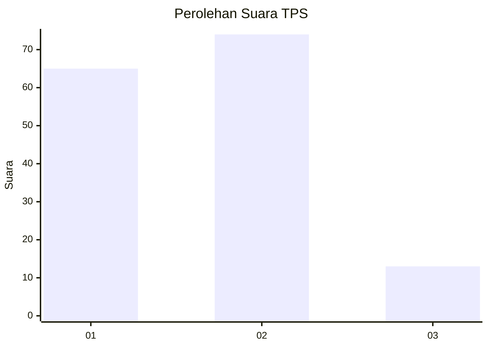
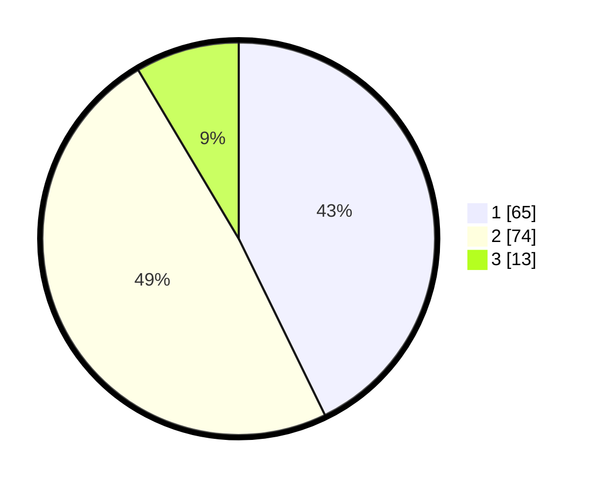

# Hasil

## Grafik

## Tabel

| No. | Nama Paslon    | Suara | Suara (raw) | Persentase |
|:--- |:-------------- | -----:| -----------:| ----------:|
| 1   | ANIES MUHAIMIN | 65    | [65][p-1]   | 42,76      |
| 2   | PRABOWO GIBRAN | 74    | [74][p-2]   | 48,68      |
| 3   | GANJAR MAHFUD  | 13    | [13][p-3]   | 8,55       |

[p-1]: https://github.com/gigit-pemilu/pemilu-2024/blob/main/pilpres/hitung-suara/sub/63-kalimantan-selatan/sub/71-kota-banjarmasin/sub/02-banjarmasin-timur/sub/1001-kuripan/sub/007-tps/sub/paslon-1.txt
[p-2]: https://github.com/gigit-pemilu/pemilu-2024/blob/main/pilpres/hitung-suara/sub/63-kalimantan-selatan/sub/71-kota-banjarmasin/sub/02-banjarmasin-timur/sub/1001-kuripan/sub/007-tps/sub/paslon-2.txt
[p-3]: https://github.com/gigit-pemilu/pemilu-2024/blob/main/pilpres/hitung-suara/sub/63-kalimantan-selatan/sub/71-kota-banjarmasin/sub/02-banjarmasin-timur/sub/1001-kuripan/sub/007-tps/sub/paslon-3.txt

## Foto C Plano

https://sirekap-obj-formc.kpu.go.id/50ef/pemilu/ppwp/63/71/02/10/01/6371021001007-20240214-222410--5787abb0-f18a-4fee-b8a2-d97febb42612.jpg

https://sirekap-obj-formc.kpu.go.id/50ef/pemilu/ppwp/63/71/02/10/01/6371021001007-20240214-222538--e615e994-2cf4-484a-9e6b-c3386c136261.jpg

https://sirekap-obj-formc.kpu.go.id/50ef/pemilu/ppwp/63/71/02/10/01/6371021001007-20240214-222630--a9ab9939-c59b-4edb-a098-4c1c5faa011f.jpg

## Metadata

| Key        | Value               |
| ---------- | ------------------- |
| Time Stamp | 2024-02-25 21:00:00 |

