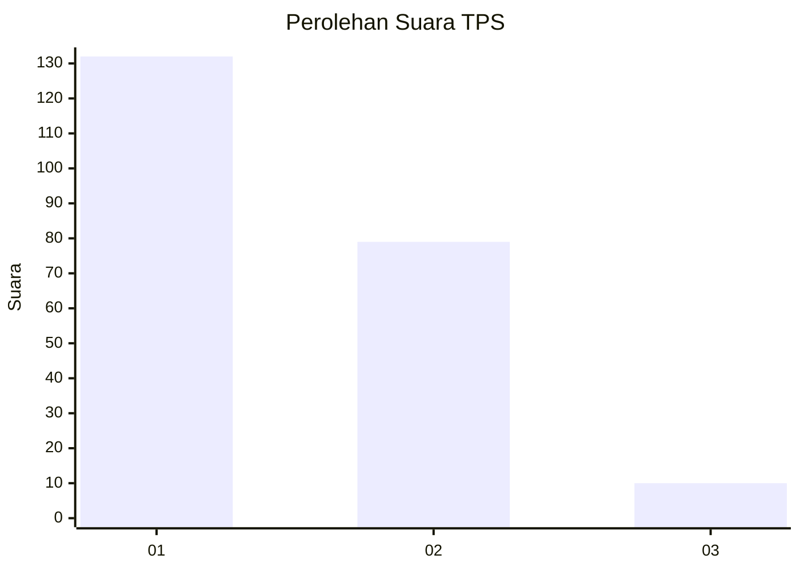
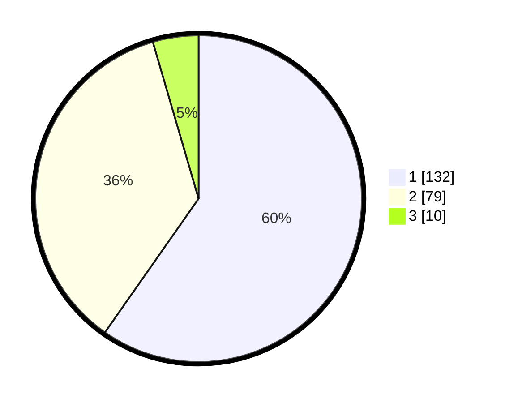

# Hasil

## Grafik

## Tabel

| No. | Nama Paslon    | Suara | Suara (raw) | Persentase |
|:--- |:-------------- | -----:| -----------:| ----------:|
| 1   | ANIES MUHAIMIN | 132   | [132][p-1]  | 59,73      |
| 2   | PRABOWO GIBRAN | 79    | [79][p-2]   | 35,75      |
| 3   | GANJAR MAHFUD  | 10    | [10][p-3]   | 4,52       |

[p-1]: https://github.com/gigit-pemilu/pemilu-2024-63-kalimantan-selatan/blob/main/pilpres/hitung-suara/sub/63-kalimantan-selatan/sub/71-kota-banjarmasin/sub/03-banjarmasin-barat/sub/1001-belitung-utara/sub/012-tps/sub/paslon-1.txt
[p-2]: https://github.com/gigit-pemilu/pemilu-2024-63-kalimantan-selatan/blob/main/pilpres/hitung-suara/sub/63-kalimantan-selatan/sub/71-kota-banjarmasin/sub/03-banjarmasin-barat/sub/1001-belitung-utara/sub/012-tps/sub/paslon-2.txt
[p-3]: https://github.com/gigit-pemilu/pemilu-2024-63-kalimantan-selatan/blob/main/pilpres/hitung-suara/sub/63-kalimantan-selatan/sub/71-kota-banjarmasin/sub/03-banjarmasin-barat/sub/1001-belitung-utara/sub/012-tps/sub/paslon-3.txt

## Foto C Plano

https://sirekap-obj-formc.kpu.go.id/2bfd/pemilu/ppwp/63/71/03/10/01/6371031001012-20240214-222829--7ecd0184-fedc-417c-aa39-e0dd5bb9195b.jpg

https://sirekap-obj-formc.kpu.go.id/2bfd/pemilu/ppwp/63/71/03/10/01/6371031001012-20240214-222842--8b22546b-c3ed-4818-b696-808a79e3479c.jpg

https://sirekap-obj-formc.kpu.go.id/2bfd/pemilu/ppwp/63/71/03/10/01/6371031001012-20240214-222846--ec934ad6-3a1a-4172-a198-9bf0297848cc.jpg

## Metadata

| Key        | Value               |
| ---------- | ------------------- |
| Time Stamp | 2024-02-15 16:00:26 |

