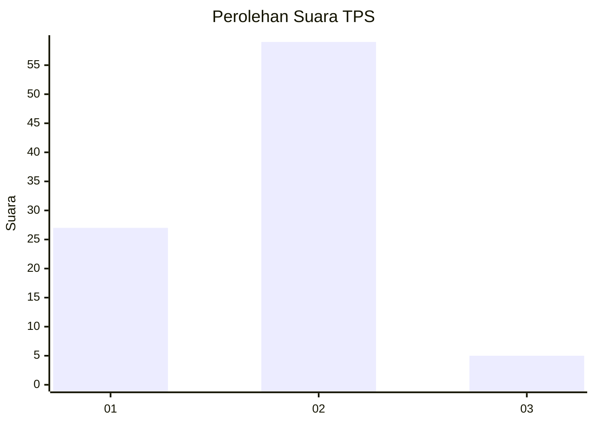
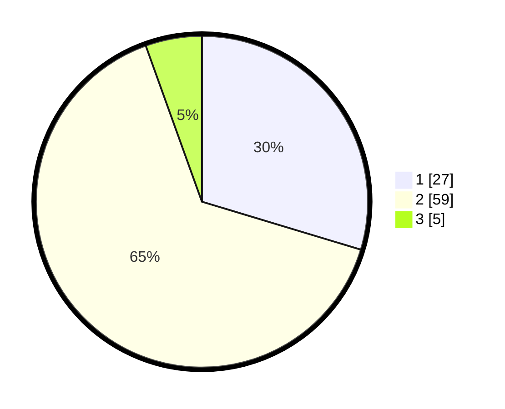

# Hasil

## Grafik

## Tabel

| No. | Nama Paslon    | Suara | Suara (raw) | Persentase |
|:--- |:-------------- | -----:| -----------:| ----------:|
| 1   | ANIES MUHAIMIN | 27    | [27][p-1]   | 29,67      |
| 2   | PRABOWO GIBRAN | 59    | [59][p-2]   | 64,84      |
| 3   | GANJAR MAHFUD  | 5     | [5][p-3]    | 5,49       |

[p-1]: https://github.com/gigit-pemilu/pemilu-2024/blob/main/pilpres/hitung-suara/sub/63-kalimantan-selatan/sub/71-kota-banjarmasin/sub/03-banjarmasin-barat/sub/1004-telaga-biru/sub/041-tps/sub/paslon-1.txt
[p-2]: https://github.com/gigit-pemilu/pemilu-2024/blob/main/pilpres/hitung-suara/sub/63-kalimantan-selatan/sub/71-kota-banjarmasin/sub/03-banjarmasin-barat/sub/1004-telaga-biru/sub/041-tps/sub/paslon-2.txt
[p-3]: https://github.com/gigit-pemilu/pemilu-2024/blob/main/pilpres/hitung-suara/sub/63-kalimantan-selatan/sub/71-kota-banjarmasin/sub/03-banjarmasin-barat/sub/1004-telaga-biru/sub/041-tps/sub/paslon-3.txt

## Foto C Plano

https://sirekap-obj-formc.kpu.go.id/a005/pemilu/ppwp/63/71/03/10/04/6371031004041-20240214-191839--8730aeed-e900-4ce2-a490-1779f053d054.jpg

https://sirekap-obj-formc.kpu.go.id/a005/pemilu/ppwp/63/71/03/10/04/6371031004041-20240214-191854--be6065cb-96f8-46d5-86b7-3498b359a703.jpg

https://sirekap-obj-formc.kpu.go.id/a005/pemilu/ppwp/63/71/03/10/04/6371031004041-20240214-191901--8d534157-9d87-4360-84fa-7005ecbc3be3.jpg

## Metadata

| Key        | Value               |
| ---------- | ------------------- |
| Time Stamp | 2024-02-15 16:30:25 |

