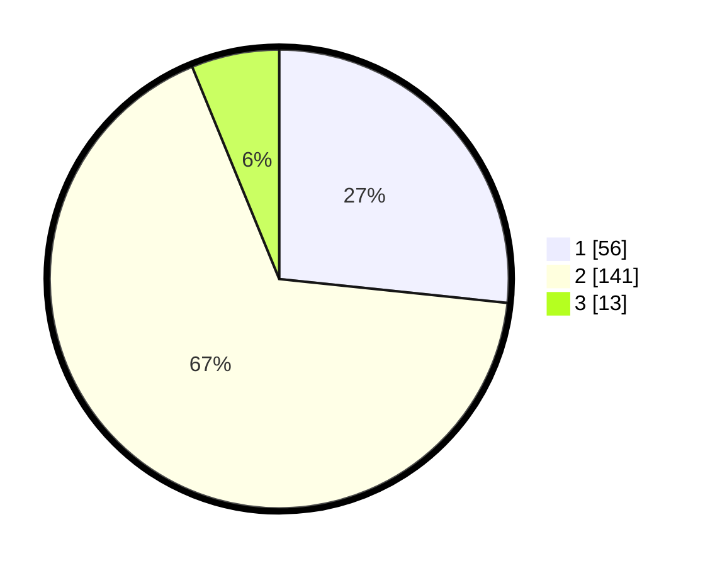

# Hasil

## Grafik

## Tabel

| No. | Nama Paslon    | Suara | Suara (raw) | Persentase |
|:--- |:-------------- | -----:| -----------:| ----------:|
| 1   | ANIES MUHAIMIN | 56    | [56][p-1]   | 26,67      |
| 2   | PRABOWO GIBRAN | 141   | [141][p-2]  | 67,14      |
| 3   | GANJAR MAHFUD  | 13    | [13][p-3]   | 6,19       |

[p-1]: https://github.com/gigit-pemilu/pemilu-2024-63-kalimantan-selatan/blob/main/pilpres/hitung-suara/sub/63-kalimantan-selatan/sub/71-kota-banjarmasin/sub/04-banjarmasin-utara/sub/1001-alalak-tengah/sub/005-tps/sub/paslon-1.txt
[p-2]: https://github.com/gigit-pemilu/pemilu-2024-63-kalimantan-selatan/blob/main/pilpres/hitung-suara/sub/63-kalimantan-selatan/sub/71-kota-banjarmasin/sub/04-banjarmasin-utara/sub/1001-alalak-tengah/sub/005-tps/sub/paslon-2.txt
[p-3]: https://github.com/gigit-pemilu/pemilu-2024-63-kalimantan-selatan/blob/main/pilpres/hitung-suara/sub/63-kalimantan-selatan/sub/71-kota-banjarmasin/sub/04-banjarmasin-utara/sub/1001-alalak-tengah/sub/005-tps/sub/paslon-3.txt

## Foto C Plano

https://sirekap-obj-formc.kpu.go.id/3f21/pemilu/ppwp/63/71/04/10/01/6371041001005-20240214-225006--a29f0e55-31bb-401d-bbb9-2a7e714762cb.jpg

https://sirekap-obj-formc.kpu.go.id/3f21/pemilu/ppwp/63/71/04/10/01/6371041001005-20240214-230631--f6488d8a-ba43-4718-b132-30740a61060c.jpg

https://sirekap-obj-formc.kpu.go.id/3f21/pemilu/ppwp/63/71/04/10/01/6371041001005-20240214-230754--cfaf5f9f-b8df-42b1-a3e6-cd47288fb989.jpg

## Metadata

| Key        | Value               |
| ---------- | ------------------- |
| Time Stamp | 2024-02-25 17:00:00 |

