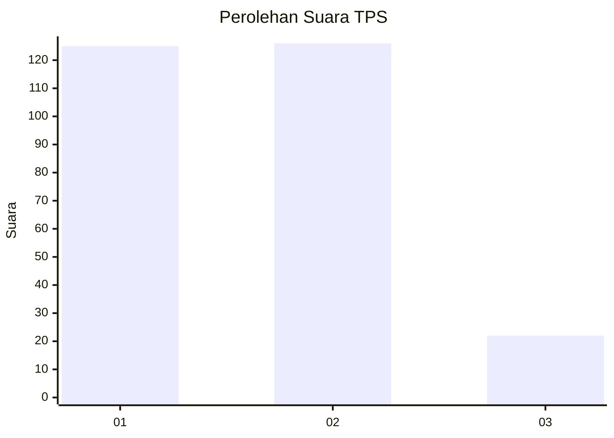
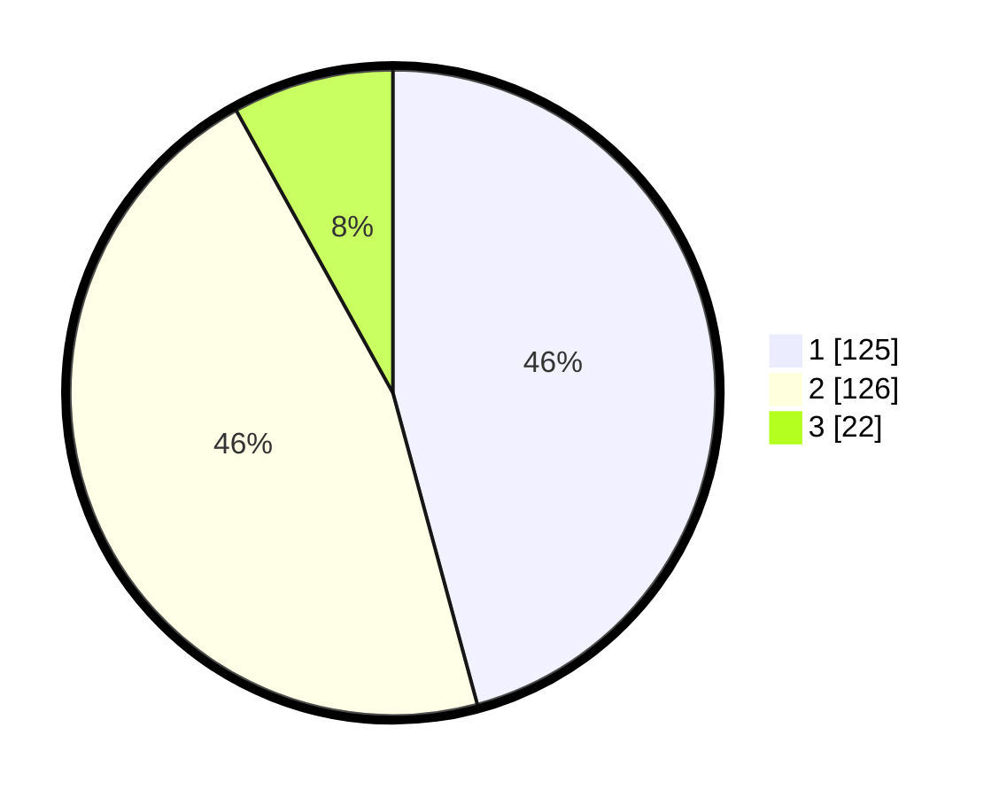

# Hasil

## Grafik

## Tabel

| No. | Nama Paslon    | Suara | Suara (raw) | Persentase |
|:--- |:-------------- | -----:| -----------:| ----------:|
| 1   | ANIES MUHAIMIN | 125   | [125][p-1]  | 45,79      |
| 2   | PRABOWO GIBRAN | 126   | [126][p-2]  | 46,15      |
| 3   | GANJAR MAHFUD  | 22    | [22][p-3]   | 8,06       |

[p-1]: https://github.com/gigit-pemilu/pemilu-2024-63-kalimantan-selatan/blob/main/pilpres/hitung-suara/sub/63-kalimantan-selatan/sub/71-kota-banjarmasin/sub/04-banjarmasin-utara/sub/1001-alalak-tengah/sub/019-tps/sub/paslon-1.txt
[p-2]: https://github.com/gigit-pemilu/pemilu-2024-63-kalimantan-selatan/blob/main/pilpres/hitung-suara/sub/63-kalimantan-selatan/sub/71-kota-banjarmasin/sub/04-banjarmasin-utara/sub/1001-alalak-tengah/sub/019-tps/sub/paslon-2.txt
[p-3]: https://github.com/gigit-pemilu/pemilu-2024-63-kalimantan-selatan/blob/main/pilpres/hitung-suara/sub/63-kalimantan-selatan/sub/71-kota-banjarmasin/sub/04-banjarmasin-utara/sub/1001-alalak-tengah/sub/019-tps/sub/paslon-3.txt

## Foto C Plano

https://sirekap-obj-formc.kpu.go.id/9be5/pemilu/ppwp/63/71/04/10/01/6371041001019-20240215-021704--377cf4c6-b2f3-43ea-b630-bc7ee23c74d0.jpg

https://sirekap-obj-formc.kpu.go.id/9be5/pemilu/ppwp/63/71/04/10/01/6371041001019-20240215-021913--8480d444-b300-45ce-af5b-4e0dfe7a4d60.jpg

https://sirekap-obj-formc.kpu.go.id/9be5/pemilu/ppwp/63/71/04/10/01/6371041001019-20240215-021953--315df45e-ab70-410a-aab4-ae78798c28be.jpg

## Metadata

| Key        | Value               |
| ---------- | ------------------- |
| Time Stamp | 2024-02-15 20:00:44 |

## DATA PEMILIH TETAP

Jumlah pemilih dalam DPT: **227**.
 * L: **342**.
 * P: **454**.

## DATA PENGGUNA HAK PILIH

Jumlah pengguna hak pilih dalam DPT: **373**.
 * L: **830**.
 * P: **603**.

Jumlah pengguna hak pilih dalam DPTb: **88**.
 * L: **8**.
 * P: **808**.

Jumlah pengguna hak pilih dalam DPK: **800**.
 * L: **80**.
 * P: **0**.

Jumlah pengguna hak pilih: **233**.
 * L: **830**.
 * P: **443**.

## JUMLAH SUARA SAH DAN TIDAK SAH

JUMLAH SELURUH SUARA SAH: **273**.

JUMLAH SUARA TIDAK SAH: **0**.

JUMLAH SELURUH SUARA SAH DAN SUARA TIDAK SAH: **273**.

