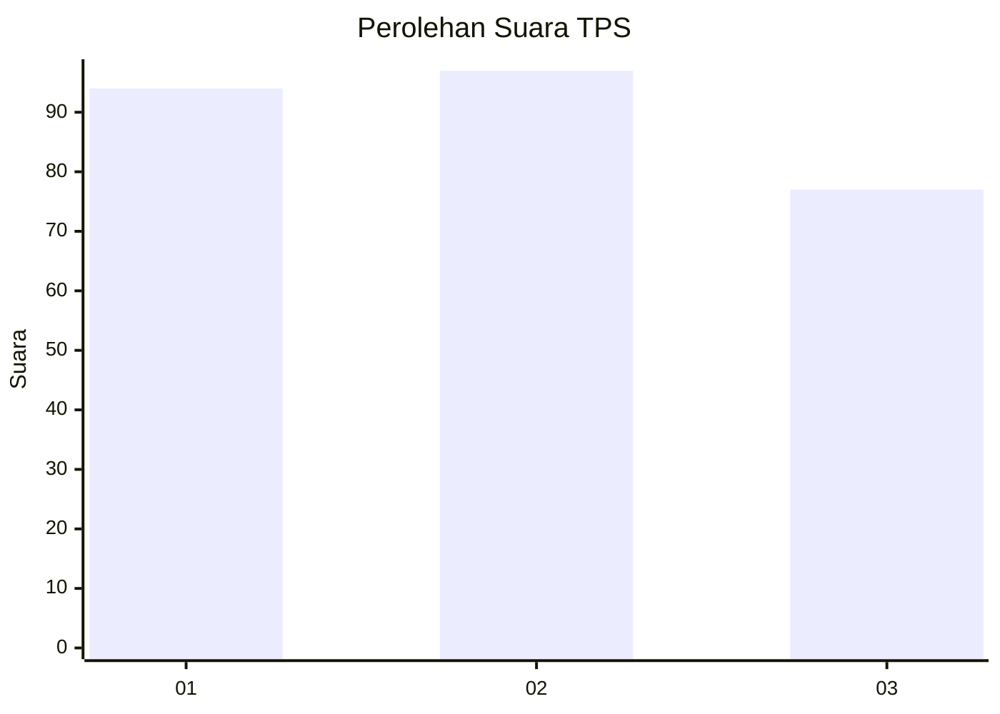
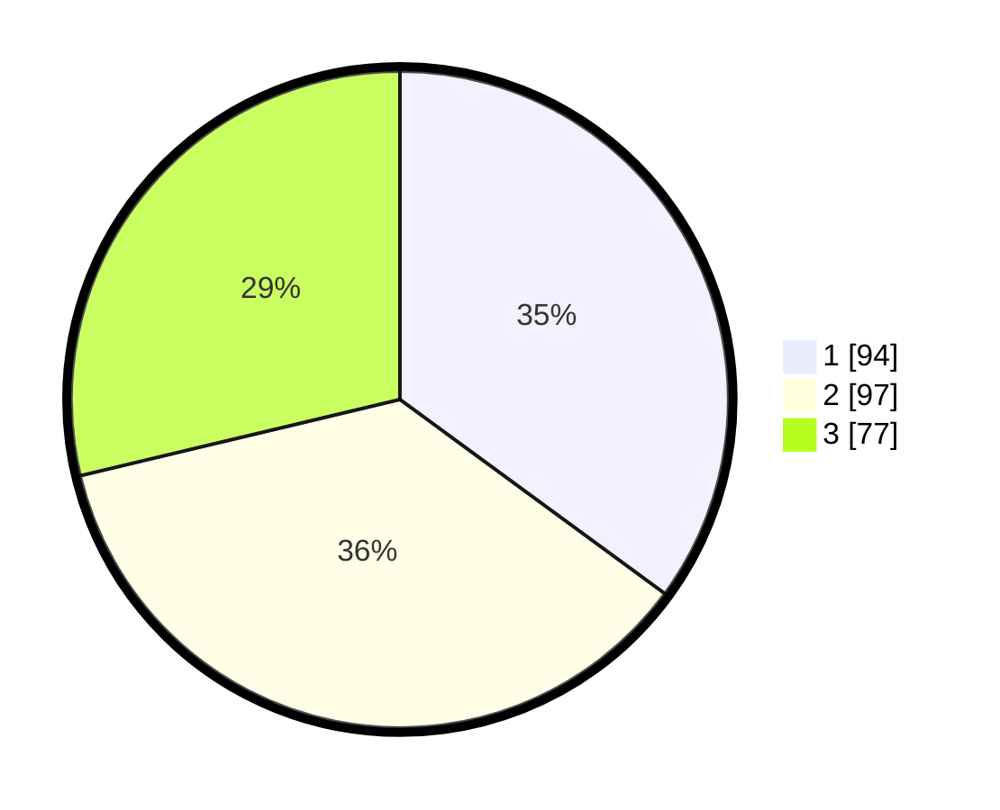

# Hasil

## Grafik

## Tabel

| No. | Nama Paslon    | Suara | Suara (raw) | Persentase |
|:--- |:-------------- | -----:| -----------:| ----------:|
| 1   | ANIES MUHAIMIN | 94    | [94][p-1]   | 35,07      |
| 2   | PRABOWO GIBRAN | 97    | [97][p-2]   | 36,19      |
| 3   | GANJAR MAHFUD  | 77    | [77][p-3]   | 28,73      |

[p-1]: https://github.com/gigit-pemilu/pemilu-2024-63-kalimantan-selatan/blob/main/pilpres/hitung-suara/sub/63-kalimantan-selatan/sub/71-kota-banjarmasin/sub/04-banjarmasin-utara/sub/1003-alalak-selatan/sub/028-tps/sub/paslon-1.txt
[p-2]: https://github.com/gigit-pemilu/pemilu-2024-63-kalimantan-selatan/blob/main/pilpres/hitung-suara/sub/63-kalimantan-selatan/sub/71-kota-banjarmasin/sub/04-banjarmasin-utara/sub/1003-alalak-selatan/sub/028-tps/sub/paslon-2.txt
[p-3]: https://github.com/gigit-pemilu/pemilu-2024-63-kalimantan-selatan/blob/main/pilpres/hitung-suara/sub/63-kalimantan-selatan/sub/71-kota-banjarmasin/sub/04-banjarmasin-utara/sub/1003-alalak-selatan/sub/028-tps/sub/paslon-3.txt

## Foto C Plano

https://sirekap-obj-formc.kpu.go.id/12a4/pemilu/ppwp/63/71/04/10/03/6371041003028-20240214-155631--466d3c61-320e-45e7-a7a0-257525d52fbd.jpg

https://sirekap-obj-formc.kpu.go.id/12a4/pemilu/ppwp/63/71/04/10/03/6371041003028-20240214-155635--c44c0f61-e393-413b-9002-c744d6973517.jpg

https://sirekap-obj-formc.kpu.go.id/12a4/pemilu/ppwp/63/71/04/10/03/6371041003028-20240214-155639--4a1d6e13-1f0c-417a-a985-8c5aaedf344b.jpg

## Metadata

| Key        | Value               |
| ---------- | ------------------- |
| Time Stamp | 2024-02-15 21:30:27 |

