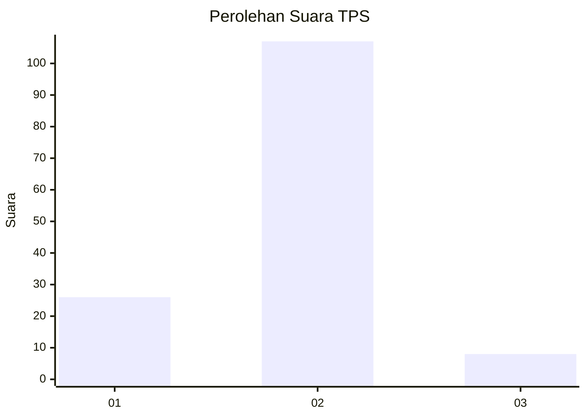
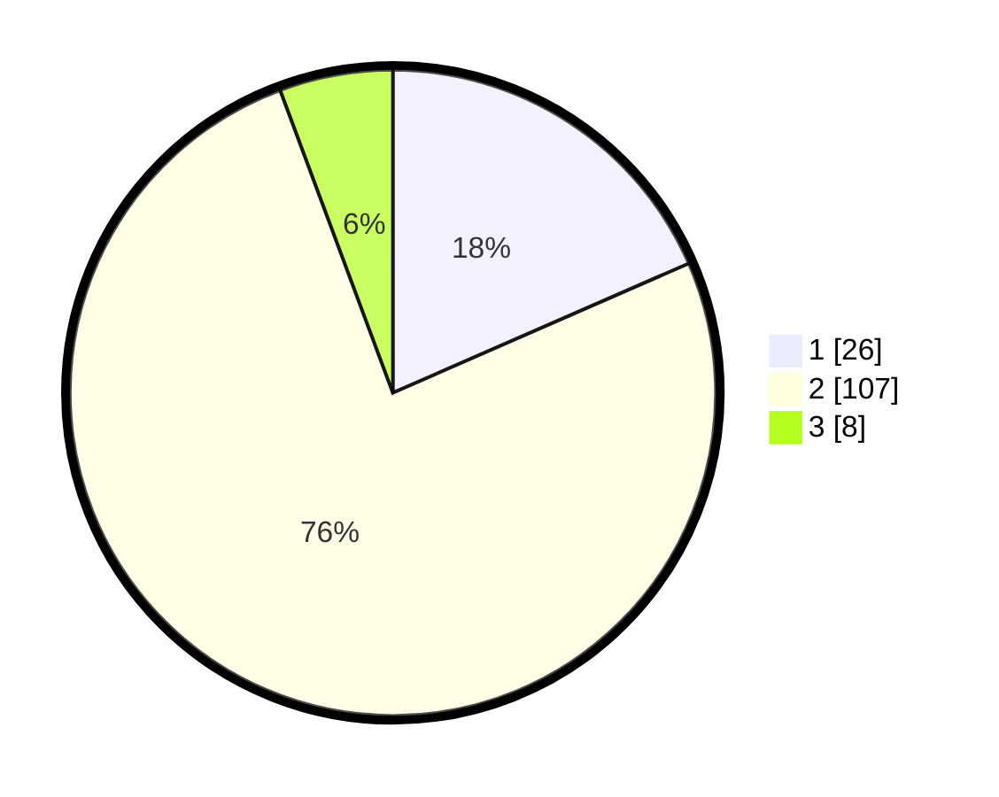

# Hasil

## Grafik

## Tabel

| No. | Nama Paslon    | Suara | Suara (raw) | Persentase |
|:--- |:-------------- | -----:| -----------:| ----------:|
| 1   | ANIES MUHAIMIN | 26    | [26][p-1]   | 18,44      |
| 2   | PRABOWO GIBRAN | 107   | [107][p-2]  | 75,89      |
| 3   | GANJAR MAHFUD  | 8     | [8][p-3]    | 5,67       |

[p-1]: https://github.com/gigit-pemilu/pemilu-2024/blob/main/pilpres/hitung-suara/sub/63-kalimantan-selatan/sub/72-kota-banjarbaru/sub/03-cempaka/sub/1001-palam/sub/001-tps/sub/paslon-1.txt
[p-2]: https://github.com/gigit-pemilu/pemilu-2024/blob/main/pilpres/hitung-suara/sub/63-kalimantan-selatan/sub/72-kota-banjarbaru/sub/03-cempaka/sub/1001-palam/sub/001-tps/sub/paslon-2.txt
[p-3]: https://github.com/gigit-pemilu/pemilu-2024/blob/main/pilpres/hitung-suara/sub/63-kalimantan-selatan/sub/72-kota-banjarbaru/sub/03-cempaka/sub/1001-palam/sub/001-tps/sub/paslon-3.txt

## Foto C Plano

https://sirekap-obj-formc.kpu.go.id/ce3a/pemilu/ppwp/63/72/03/10/01/6372031001001-20240217-092034--25c843aa-8337-4f05-be12-952379ec939d.jpg

https://sirekap-obj-formc.kpu.go.id/ce3a/pemilu/ppwp/63/72/03/10/01/6372031001001-20240217-092119--1d2ff11d-9a3f-4ad4-8132-08aec31e0735.jpg

https://sirekap-obj-formc.kpu.go.id/ce3a/pemilu/ppwp/63/72/03/10/01/6372031001001-20240215-214713--0fbe00ff-af5d-4844-8b66-e8a203d3b041.jpg

## Metadata

| Key        | Value               |
| ---------- | ------------------- |
| Time Stamp | 2024-02-19 11:00:00 |

