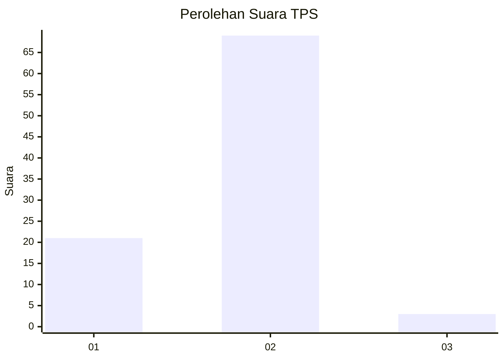
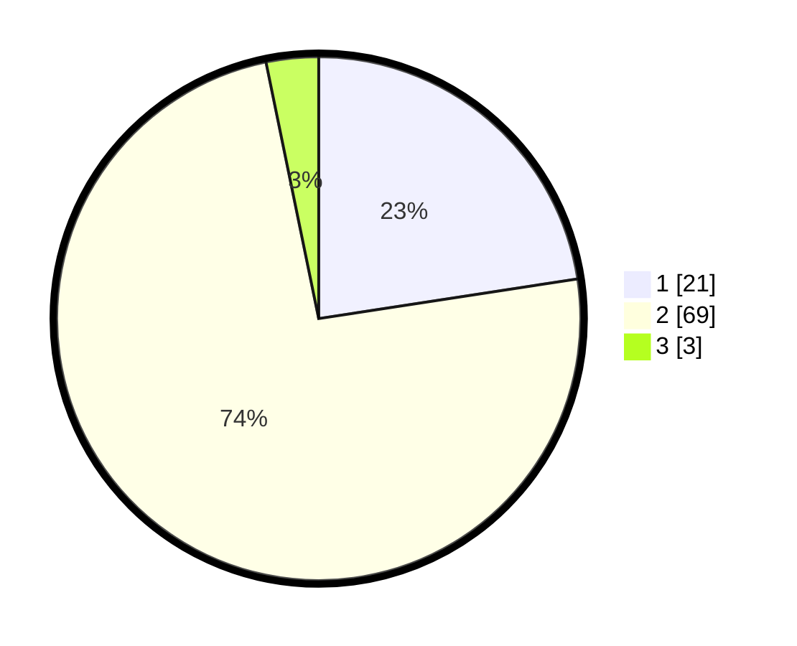

# Hasil

## Grafik

## Tabel

| No. | Nama Paslon    | Suara | Suara (raw) | Persentase |
|:--- |:-------------- | -----:| -----------:| ----------:|
| 1   | ANIES MUHAIMIN | 21    | [21][p-1]   | 22,58      |
| 2   | PRABOWO GIBRAN | 69    | [69][p-2]   | 74,19      |
| 3   | GANJAR MAHFUD  | 3     | [3][p-3]    | 3,23       |

[p-1]: https://github.com/gigit-pemilu/pemilu-2024/blob/main/pilpres/hitung-suara/sub/63-kalimantan-selatan/sub/72-kota-banjarbaru/sub/03-cempaka/sub/1001-palam/sub/008-tps/sub/paslon-1.txt
[p-2]: https://github.com/gigit-pemilu/pemilu-2024/blob/main/pilpres/hitung-suara/sub/63-kalimantan-selatan/sub/72-kota-banjarbaru/sub/03-cempaka/sub/1001-palam/sub/008-tps/sub/paslon-2.txt
[p-3]: https://github.com/gigit-pemilu/pemilu-2024/blob/main/pilpres/hitung-suara/sub/63-kalimantan-selatan/sub/72-kota-banjarbaru/sub/03-cempaka/sub/1001-palam/sub/008-tps/sub/paslon-3.txt

## Foto C Plano

https://sirekap-obj-formc.kpu.go.id/d5d6/pemilu/ppwp/63/72/03/10/01/6372031001008-20240216-082539--023a94bb-892c-45e9-be35-038a2268dea2.jpg

https://sirekap-obj-formc.kpu.go.id/d5d6/pemilu/ppwp/63/72/03/10/01/6372031001008-20240214-141748--50fe40eb-d04d-4560-8f0b-c185959b136f.jpg

https://sirekap-obj-formc.kpu.go.id/d5d6/pemilu/ppwp/63/72/03/10/01/6372031001008-20240214-141017--68c3f1d8-c8fd-44cf-a83d-573a2a23f368.jpg

## Metadata

| Key        | Value               |
| ---------- | ------------------- |
| Time Stamp | 2024-02-19 11:00:00 |

