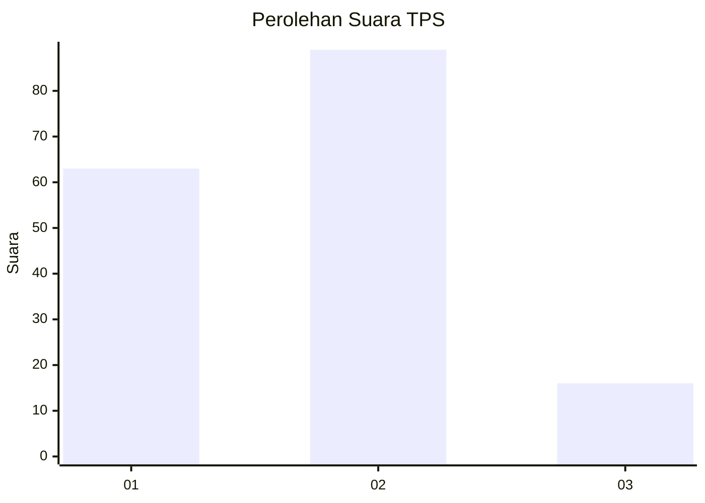

# Hasil

## Grafik

## Tabel

| No. | Nama Paslon    | Suara | Suara (raw) | Persentase |
|:--- |:-------------- | -----:| -----------:| ----------:|
| 1   | ANIES MUHAIMIN | 63    | [63][p-1]   | 37,50      |
| 2   | PRABOWO GIBRAN | 89    | [89][p-2]   | 52,98      |
| 3   | GANJAR MAHFUD  | 16    | [16][p-3]   | 9,52       |

[p-1]: https://github.com/gigit-pemilu/pemilu-2024-63-kalimantan-selatan/blob/main/pilpres/hitung-suara/sub/63-kalimantan-selatan/sub/72-kota-banjarbaru/sub/04-banjarbaru-utara/sub/1001-loktabat-utara/sub/002-tps/sub/paslon-1.txt
[p-2]: https://github.com/gigit-pemilu/pemilu-2024-63-kalimantan-selatan/blob/main/pilpres/hitung-suara/sub/63-kalimantan-selatan/sub/72-kota-banjarbaru/sub/04-banjarbaru-utara/sub/1001-loktabat-utara/sub/002-tps/sub/paslon-2.txt
[p-3]: https://github.com/gigit-pemilu/pemilu-2024-63-kalimantan-selatan/blob/main/pilpres/hitung-suara/sub/63-kalimantan-selatan/sub/72-kota-banjarbaru/sub/04-banjarbaru-utara/sub/1001-loktabat-utara/sub/002-tps/sub/paslon-3.txt

## Foto C Plano

https://sirekap-obj-formc.kpu.go.id/0cc6/pemilu/ppwp/63/72/04/10/01/6372041001002-20240218-150213--cec7c3f7-9e5a-4644-98ab-302183eede03.jpg

https://sirekap-obj-formc.kpu.go.id/0cc6/pemilu/ppwp/63/72/04/10/01/6372041001002-20240218-150248--f789869e-4735-4aea-a7df-03c9191c7951.jpg

https://sirekap-obj-formc.kpu.go.id/0cc6/pemilu/ppwp/63/72/04/10/01/6372041001002-20240218-150321--f5405cbf-1447-4e1f-98d1-09602e1ea095.jpg

## Metadata

| Key        | Value               |
| ---------- | ------------------- |
| Time Stamp | 2024-02-25 17:00:00 |

