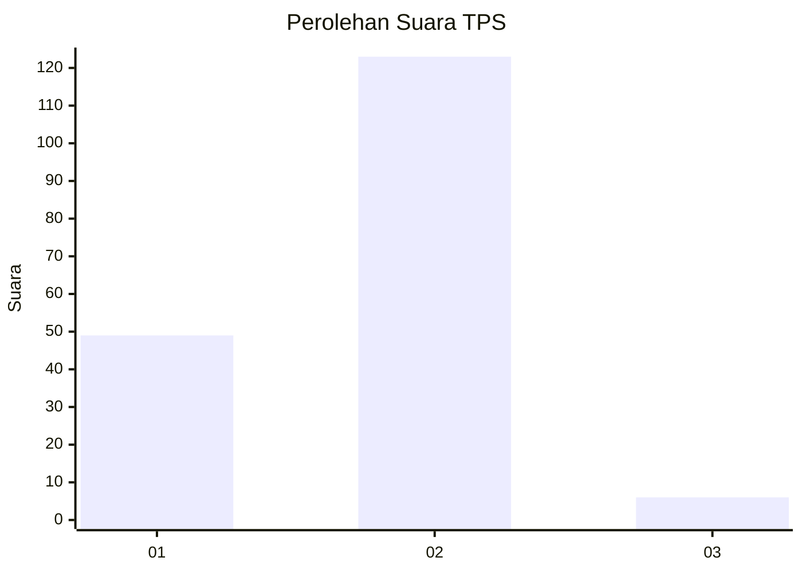
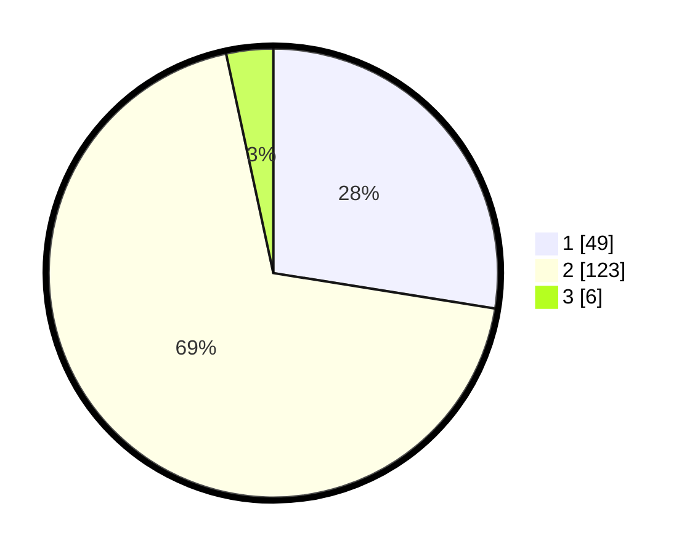

# Hasil

## Grafik

## Tabel

| No. | Nama Paslon    | Suara | Suara (raw) | Persentase |
|:--- |:-------------- | -----:| -----------:| ----------:|
| 1   | ANIES MUHAIMIN | 49    | [49][p-1]   | 27,53      |
| 2   | PRABOWO GIBRAN | 123   | [123][p-2]  | 69,10      |
| 3   | GANJAR MAHFUD  | 6     | [6][p-3]    | 3,37       |

[p-1]: https://github.com/gigit-pemilu/pemilu-2024/blob/main/pilpres/hitung-suara/sub/63-kalimantan-selatan/sub/72-kota-banjarbaru/sub/04-banjarbaru-utara/sub/1001-loktabat-utara/sub/006-tps/sub/paslon-1.txt
[p-2]: https://github.com/gigit-pemilu/pemilu-2024/blob/main/pilpres/hitung-suara/sub/63-kalimantan-selatan/sub/72-kota-banjarbaru/sub/04-banjarbaru-utara/sub/1001-loktabat-utara/sub/006-tps/sub/paslon-2.txt
[p-3]: https://github.com/gigit-pemilu/pemilu-2024/blob/main/pilpres/hitung-suara/sub/63-kalimantan-selatan/sub/72-kota-banjarbaru/sub/04-banjarbaru-utara/sub/1001-loktabat-utara/sub/006-tps/sub/paslon-3.txt

## Foto C Plano

https://sirekap-obj-formc.kpu.go.id/3e7a/pemilu/ppwp/63/72/04/10/01/6372041001006-20240218-144548--6bace70b-c7e2-45a0-8898-76a496cc961f.jpg

https://sirekap-obj-formc.kpu.go.id/3e7a/pemilu/ppwp/63/72/04/10/01/6372041001006-20240218-144640--b89fc6ff-55b2-41bd-b515-30dbc188e13e.jpg

https://sirekap-obj-formc.kpu.go.id/3e7a/pemilu/ppwp/63/72/04/10/01/6372041001006-20240218-144726--3f0581cb-af7f-4e54-9a68-8a1a0eceac5a.jpg

## Metadata

| Key        | Value               |
| ---------- | ------------------- |
| Time Stamp | 2024-02-24 22:31:28 |

