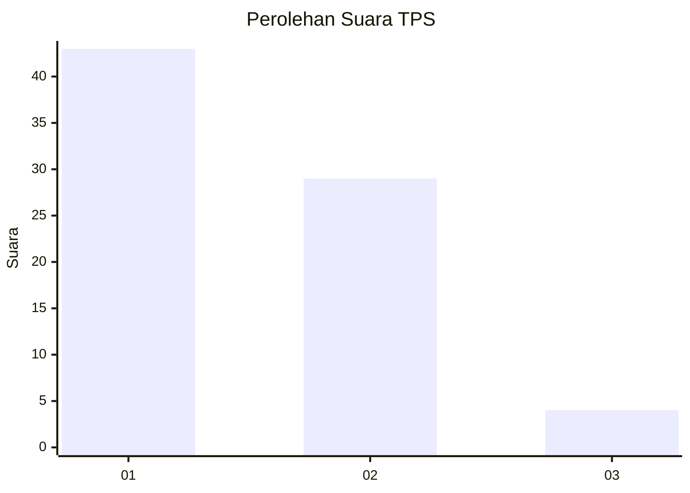
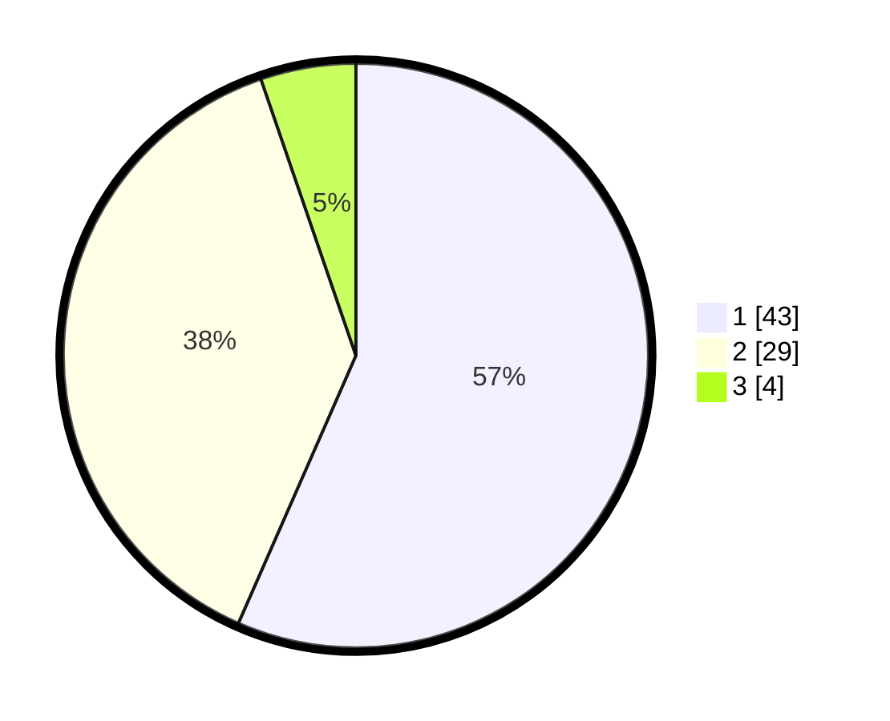

# Hasil

## Grafik

## Tabel

| No. | Nama Paslon    | Suara | Suara (raw) | Persentase |
|:--- |:-------------- | -----:| -----------:| ----------:|
| 1   | ANIES MUHAIMIN | 43    | [43][p-1]   | 56,58      |
| 2   | PRABOWO GIBRAN | 29    | [29][p-2]   | 38,16      |
| 3   | GANJAR MAHFUD  | 4     | [4][p-3]    | 5,26       |

[p-1]: https://github.com/gigit-pemilu/pemilu-2024/blob/main/pilpres/hitung-suara/sub/63-kalimantan-selatan/sub/72-kota-banjarbaru/sub/05-banjarbaru-selatan/sub/1003-kemuning/sub/007-tps/sub/paslon-1.txt
[p-2]: https://github.com/gigit-pemilu/pemilu-2024/blob/main/pilpres/hitung-suara/sub/63-kalimantan-selatan/sub/72-kota-banjarbaru/sub/05-banjarbaru-selatan/sub/1003-kemuning/sub/007-tps/sub/paslon-2.txt
[p-3]: https://github.com/gigit-pemilu/pemilu-2024/blob/main/pilpres/hitung-suara/sub/63-kalimantan-selatan/sub/72-kota-banjarbaru/sub/05-banjarbaru-selatan/sub/1003-kemuning/sub/007-tps/sub/paslon-3.txt

## Foto C Plano

https://sirekap-obj-formc.kpu.go.id/1aa3/pemilu/ppwp/63/72/05/10/03/6372051003007-20240215-231048--5c63adf2-4db6-4ac4-a61e-b5bdc9a3c4c0.jpg

https://sirekap-obj-formc.kpu.go.id/1aa3/pemilu/ppwp/63/72/05/10/03/6372051003007-20240215-231509--c3295139-fd9b-4ca5-a58a-f1b10da1e8ca.jpg

https://sirekap-obj-formc.kpu.go.id/1aa3/pemilu/ppwp/63/72/05/10/03/6372051003007-20240215-231740--e7470664-6de5-4dc8-870a-5bcdaf13d8f9.jpg

## Metadata

| Key        | Value               |
| ---------- | ------------------- |
| Time Stamp | 2024-02-25 16:00:00 |

